# 「需恋」V2 增量架构设计与任务分解

> 版本：v2.0（增量）｜ 架构师：高见远（Bob）｜ 日期：2026-09-05
> 需求基线：`docs/REQUIREMENTS_V2.md`（19 节，已完整读取）
> 代码基线：**实际代码**（`server/` 45 个文件 / `src/` 38 个文件 / `shared/` 4 个文件）
> 上游文档：`docs/system_design.md`（v1，2941 行）
>
> **本文只描述增量。V1 已正确实现且不需要改动的，一律引用原文档，不重复复述。**
> 凡 V1 文档与本文冲突之处，以本文为准（本文基于**实际代码**而非 V1 文档撰写）。

---

## 0. 结论摘要（60 秒版）

| 维度 | 决策 |
|---|---|
| 总体策略 | **扩展而非重写**。8 层 Prompt 架构一条不删，只追加；`shared/constants.ts` 改为「单一数据源 + 派生导出」，保证现有 import 全部不失效 |
| 最大结构性缺口 | **没有账号系统**。`X-User-Id` 裸头 = 任何人可冒充任何人，验收标准第 1/11 条都不成立。这是 V2 的**唯一阻塞项**，必须先做 |
| 认证实现 | Node 内置 `crypto`：`scryptSync`（N=16384, r=8, p=1）存密码；`createHmac('sha256')` 签会话；`randomBytes` 出 salt/sessionId。**零新增依赖** |
| 数据层 | **新增 7 张表**（auth / sessions / stories / insights / habits / feedback / trend）+ **6 张表 ALTER**（users / ai_characters / conversations / messages / memories / safety_logs），全部走 `migrations.ts` 的 **v2 幂等迁移** |
| 主动等级 | `proactivity_level`（0..1）**保留不删**，新增 `proactivity_tier` 为唯一真值源；四档通过 **4 个正交旋钮**生效（阈值偏移 / 权重重分配 / 空闲曲线 / 否决参数），**不是乘系数** |
| 聊天模式 | 不替换 `StrategyType`，另立 `ChatMode`（9 种 + `auto`）。`StrategyType` 从 8 个扩到 **13 个**（新增 5 个由模式引入）。**危机与安全拦截永远优先于用户选择** |
| 人格隔离 | **三层隔离（Prompt 层位 / 宪法条款 / 白名单维度）+ 三道写入闸门（枚举取值 / 置信度累积 / LLM 反向校验）**。`habitService` 架构上禁止 import `characters.repo.ts` |
| 情绪趋势 | 只输出 **预定义常量表里的定性文案**，`TrendDescription` 类型**不含数字字段** → 类型层面堵死百分比；画图用 `-2..2` 整数档位而非分数 |
| 任务数 | **12 个工程任务（T01–T12），分 5 个交付批次（B1–B5）** |
| 风险最高 3 点 | ① L1b/L7 改动破坏已有人格稳定性 ② 匿名老账号升级为注册账号的数据归属 ③ 9 模式只改 UI 不改 Prompt（V2-8 硬约束） |

---

## 1. 差距确认表

### 1.1 复核结论总览

| 分类 | 团队盘点 | 我的复核 | 说明 |
|---|---|---|---|
| 从零建 | 8 项 | **6 项正确 / 2 项判断偏差** | 见 §1.2 |
| 需重构 | 5 项 | **5 项正确，其中 1 项需扩大范围** | 见 §1.3 |
| 只需强化 | 2 项 | **2 项正确，但都缺关键子项** | 见 §1.4 |
| 团队漏掉 | — | **6 项** | 见 §1.5 |

### 1.2 「完全不存在」项复核

| 项 | 团队判断 | 复核 | 证据 |
|---|---|---|---|
| 用户注册/登录/会话 | ✅ 正确 | ✅ 确认 | `server/http.ts:96 resolveUser` 只读 `X-User-Id` 头 + 校验存在性；`users` 表无任何凭据列 |
| 「我们的故事」 | ✅ 正确 | ✅ 确认 | schema.sql 无 stories 类表；`server/services/` 9 个服务中无 story 相关 |
| 「AI 了解的你」 | ✅ 正确 | ⚠️ **有半成品** | `MEMORY_CATEGORIES` 含 `communication`，`buildMemoryExtractPrompt` 已能抽「希望的交流方式」。但产出是**零散记忆条目**，不是**结构化偏好画像**（无维度、无置信度、无取值域）。→ 需新建，但可**复用抽取链路** |
| AI 后天交流习惯 | ✅ 正确 | ✅ 确认 | `ai_characters` 无任何 habit 字段 |
| 用户举报/内容反馈 | ✅ 正确 | ⚠️ **有相邻物** | `safety_logs` 存在但**只由系统写**（`safetyService`），无 message_id 关联、无用户上报入口。→ 需新建 `message_feedback` + ALTER `safety_logs` |
| 「我们的空间」主页 | 从零建 | ❌ **判断偏差：是重构不是新建** | `src/pages/HomePage.tsx` **已存在**（197 行），含角色卡 / 主动消息收件箱 / 角色切换 3 块真实数据区。→ 是**信息架构重写**，不是从零建 |
| 情绪变化趋势分析 | 从零建 | ❌ **判断偏差：底层已有，缺聚合层** | `user_emotion_analyses` 表已有 `trend`（improving/stable/worsening）+ `valence`/`intensity`/`share_depth`；`userEmotionService` 已算 trend。缺的是：①**按天快照聚合** ②**定性描述输出** ③**回灌策略**。→ 新建一个聚合服务 + 一张快照表即可，不需要动情绪分析本身 |
| 用户可选聊天模式 | ✅ 正确 | ✅ 确认 | `STRATEGY_TYPES` 8 个值，其中 `crisis_care` / `blocked` 是系统专用 → 用户可感知的 AI 自选策略实为 **6 种**，与团队判断一致 |

### 1.3 「存在但需重构」项复核

| 项 | 复核 | 影响面（比我预估更大的部分） |
|---|---|---|
| `proactivityLevel` → 四档枚举 | ✅ 正确 | 除 `ai_characters` 表、`shared/types.ts`、`constants.ts`、`decisionService` 外，**6 个预设角色**（`PRESET_CHARACTERS`，值 0.35/0.4/0.5/0.6/0.65/0.7）也要迁移；`personaService.idealGapHours()` 也要改 |
| 主动决策 7 → 10 因子 | ✅ 正确 | `PROACTIVE_WEIGHTS` 是 `as const` 且被 `decisionService.record()` 用 `keyof typeof` 约束 → 改常量即触发编译错误，**必须同步改** |
| 6 策略 → 9 种用户可选模式 | ✅ 正确 | **范围比团队预估大**：不能简单把 9 个模式塞进 `StrategyType`，否则会挤掉 `crisis_care` / `blocked` 两条系统策略。必须引入独立的 `ChatMode` 概念（详见 §4.2） |
| 首页 → 我们的空间 | ✅ 正确 | V1 设计的 `src/components/home/`（6 个组件）**实际未实现**，全部内联在 HomePage.tsx。→ 要拆组件 |
| 鉴权 | ✅ 正确 | 除 `resolveUser` 外，还要改：`src/api/client.ts`（132 行注入 `X-User-Id`）、`src/hooks/useUserId.ts`（bootstrap 流程）、`server/index.ts` 的 CORS `Access-Control-Allow-Headers`（50 行，需加 `Authorization`） |

### 1.4 「已存在只需强化」项复核

| 项 | 复核 | 缺的关键子项 |
|---|---|---|
| 安全系统 | ✅ 基本满足，需补 | ①**未成年保护完全缺失**（`SAFETY_CONFIG` 只有 SEXUAL/DRUG/GAMBLING/DANGEROUS 四类，`users` 表无出生日期）②规则**分散在三处**（`prompts.ts` L0 硬编码 / `SAFETY_CONFIG` 词库 / `generatorService` 内联禁止语）→ 需统一为 `safetyPolicyService` |
| 隐私 | ✅ 基本满足，需补 | `privacy_settings` 已有 3 个开关，`MemoryPage` 已实现查看/删除。缺：①**记忆配额上限**（V2-15「AI 不得无限制保存」没有量化约束）②**保留期限**（需 `memories.expires_at`）③隐私设置页需要暴露「关闭长期记忆」的**真实后果说明** |

### 1.5 团队漏掉 / 判断错的 6 项（我的补充）

| # | 漏项 | 严重度 | 说明 |
|---|---|---|---|
| **D1** | **V1 设计文档与实际代码存在落差** | 🔴 高 | V1 文档列了 12 个路由模块、6 个 home 组件、5 个 chat 组件、5 个 character 组件、3 个 memory 组件、5 个 settings 组件、4 个 hooks。实际：`routes/` 只有 **7 个**（缺 `conversationRoutes` / `emotionRoutes` / `relationshipRoutes` / `presenceRoutes`）；`components/` 只有 `chat/` + `common/`（缺 `home/` `character/` `memory/` `settings/`）；`hooks/` 缺 `useCharacters` `useConversations` `useHeartbeat`。→ **V2 的部分"新建"实为"补 V1 欠账"**，任务量要按实际代码估 |
| **D2** | **`safety_logs` 无法关联到具体消息** | 🔴 高 | 只有 `excerpt`（前 60 字），无 `message_id` / `conversation_id`。V2-14 举报要「进入后端用于安全处理」，无法定位原文 = 形同虚设。→ 必须 ALTER |
| **D3** | **验收标准第 11 条（App 重启后数据不丢失）目前不成立** | 🔴 高 | userId 存 `localStorage`，清缓存/换浏览器/换设备即全丢。这不是"要不要做注册"的体验问题，是**验收不通过**。→ 强化了账号系统的 P1 定位 |
| **D4** | **缺「最近聊天主题」的结构化存储** | 🟡 中 | V2-9 要求展示「最近聊天主题」。`conversations` 只有 `summary`（滚动摘要，非结构化）。→ ALTER 加 `recent_topics`（JSON array）+ 新增 `topicService` |
| **D5** | **SQLite 的 `UNIQUE(a, NULL)` 不去重** | 🟡 中 | 「AI 了解的你」若用 `character_id TEXT` 可空 + `UNIQUE(user_id, character_id, dimension)`，**全域偏好的 NULL 会绕过唯一约束**导致重复行。→ 必须用 `character_scope TEXT NOT NULL DEFAULT ''`，`''` 表示全域 |
| **D6** | **「AI 了解的你」的维度归属未定** | 🟡 中 | 是「用户对所有 AI 的通用偏好」还是「对这个 AI 的偏好」？需求未说清。→ 我的方案：`character_scope` 双轨制（全域默认 + 角色覆盖），见 §10 待明确 #1 |

---

## 2. 新增 / 改动的数据表

### 2.1 总览

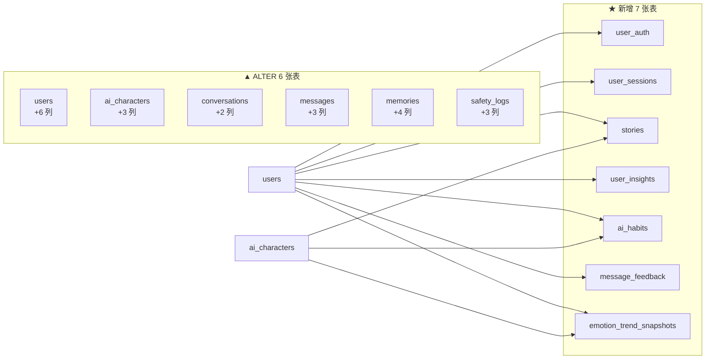

**迁移策略统一约定**

1. 新表的 `CREATE TABLE IF NOT EXISTS` **直接追加进 `server/db/schema.sql`**（与 V1 一致，靠 `db.exec()` 每次启动幂等执行）。
2. 所有 `ALTER TABLE` **不写进 schema.sql**，写进 `server/db/migrations.ts` 的 `version: 2` 迁移，用 `addColumnIfMissing(db, table, column, ddlFragment)` 包裹（靠 `PRAGMA table_info()` 判断），保证幂等。
3. 迁移 v2 全部包在一个 `db.transaction()` 内（沿用现有 `runMigrations` 机制），失败整体回滚。
4. **所有新增列必须有 `NOT NULL DEFAULT`**（SQLite 的 `ADD COLUMN` 要求非空列必须有默认值），且默认值必须**语义无害**，保证现有 76 项冒烟测试不失效。

---

### 2.2 新增表 DDL

> 约定沿用 V1：ISO 8601 UTC 字符串；JSON 列用 TEXT；布尔用 INTEGER 0/1；`day` 为用户时区 `YYYY-MM-DD`。

#### 表 1 / 7：`user_auth` — 认证凭据

```sql
-- 与 users 严格 1:1。注册时复用当前匿名 users 行 → 老用户零数据迁移。
CREATE TABLE IF NOT EXISTS user_auth (
  user_id             TEXT PRIMARY KEY REFERENCES users(id) ON DELETE CASCADE,
  email               TEXT NOT NULL UNIQUE,
  email_normalized    TEXT NOT NULL UNIQUE,        -- lower(trim(email))，防大小写重复注册
  phone               TEXT,                        -- 预留：P3 手机号登录，当前恒为 NULL
  password_hash       TEXT NOT NULL,               -- 自描述格式 'scrypt$N$r$p$saltB64$hashB64'
  password_algo       TEXT NOT NULL DEFAULT 'scrypt-16384-8-1',  -- 未来可调参数而不必重算全库
  password_updated_at TEXT NOT NULL,
  failed_attempts     INTEGER NOT NULL DEFAULT 0,
  locked_until        TEXT,                        -- 暴力破解保护：连续失败 10 次锁 15 分钟
  created_at          TEXT NOT NULL,
  updated_at          TEXT NOT NULL
);
CREATE INDEX IF NOT EXISTS idx_userauth_locked ON user_auth(locked_until);
```

#### 表 2 / 7：`user_sessions` — 会话

```sql
CREATE TABLE IF NOT EXISTS user_sessions (
  id           TEXT PRIMARY KEY,
  user_id      TEXT NOT NULL REFERENCES users(id) ON DELETE CASCADE,
  token_hash   TEXT NOT NULL UNIQUE,               -- sha256(token)，绝不存明文
  user_agent   TEXT,
  ip_prefix    TEXT,                               -- 仅存前 3 段（脱敏），不存完整 IP
  issued_at    TEXT NOT NULL,
  expires_at   TEXT NOT NULL,
  last_used_at TEXT NOT NULL,                      -- 滑动续期：活跃则后延，上限 30 天
  revoked_at   TEXT,                               -- 登出 / 改密码 / 封禁时置位
  created_at   TEXT NOT NULL
);
CREATE INDEX IF NOT EXISTS idx_sess_user    ON user_sessions(user_id, revoked_at, expires_at DESC);
CREATE INDEX IF NOT EXISTS idx_sess_expires ON user_sessions(expires_at);
```

**Token 结构**（无状态验签 + 有状态吊销，双保险）：

```
token = base64url(payloadJson) + "." + base64url(HMAC_SHA256(payloadJson, SESSION_SECRET))
payloadJson = {"sid":"<session id>","uid":"<user id>","iat":<epoch_ms>,"exp":<epoch_ms>}
```

- **第一道（无状态）**：HMAC 验签失败 → 立即 401，不查库。用 `crypto.timingSafeEqual` 做常数时间比较。
- **第二道（有状态）**：按 `sha256(token)` 查 `user_sessions`，校验 `revoked_at IS NULL` 且 `expires_at > now` → 支持主动吊销。

#### 表 3 / 7：`stories` — 我们的故事（V2-2）

```sql
CREATE TABLE IF NOT EXISTS stories (
  id                 TEXT PRIMARY KEY,
  user_id            TEXT NOT NULL REFERENCES users(id) ON DELETE CASCADE,
  character_id       TEXT NOT NULL REFERENCES ai_characters(id) ON DELETE CASCADE,
  -- 6 种类型，严格对应 V2-2
  type               TEXT NOT NULL,
                     -- first_chat | user_shared | shared_milestone
                     -- | user_saved | habit_learned | special_interaction
  title              TEXT NOT NULL,               -- 当前生效标题
  summary            TEXT NOT NULL,               -- 当前生效摘要（≤200 字）
  auto_title         TEXT NOT NULL DEFAULT '',    -- 自动生成原文，用户改过后可「还原」
  auto_summary       TEXT NOT NULL DEFAULT '',
  is_user_edited     INTEGER NOT NULL DEFAULT 0,
  is_user_created    INTEGER NOT NULL DEFAULT 0,  -- 用户手动创建（type=user_saved）
  importance         REAL NOT NULL DEFAULT 0.5,   -- 0..1，超上限时按此归档
  source_type        TEXT NOT NULL DEFAULT 'auto',-- auto(rule) | llm | user | habit
  source_message_ids TEXT NOT NULL DEFAULT '[]',  -- JSON string[]，★V2-2「必须可追溯来源」
  source_memory_id   TEXT,
  source_habit_id    TEXT,
  happened_at        TEXT NOT NULL,               -- 故事发生的时刻（≠ 创建时刻）
  pinned             INTEGER NOT NULL DEFAULT 0,
  deleted_at         TEXT,                        -- 软删除（云端同步预留）
  created_at         TEXT NOT NULL,
  updated_at         TEXT NOT NULL
);
CREATE INDEX IF NOT EXISTS idx_stories_time  ON stories(user_id, character_id, deleted_at, happened_at DESC);
CREATE INDEX IF NOT EXISTS idx_stories_type  ON stories(user_id, character_id, type, happened_at DESC);
CREATE INDEX IF NOT EXISTS idx_stories_rank  ON stories(user_id, deleted_at, pinned DESC, importance DESC);
```

#### 表 4 / 7：`user_insights` — AI 了解的你（V2-3）

```sql
CREATE TABLE IF NOT EXISTS user_insights (
  id                TEXT PRIMARY KEY,
  user_id           TEXT NOT NULL REFERENCES users(id) ON DELETE CASCADE,
  -- ★ 避坑 D5：SQLite 的 UNIQUE 对 NULL 不去重，必须用 '' 而非 NULL 表示「全域」
  character_scope   TEXT NOT NULL DEFAULT '',   -- '' = 全域偏好；否则 = 某个 character_id
  dimension         TEXT NOT NULL,              -- 白名单，见下表
  value             TEXT NOT NULL,              -- 枚举值（受控）
  value_label       TEXT NOT NULL,              -- 展示用繁中标签
  confidence        REAL NOT NULL DEFAULT 0,    -- 0..1，≥0.6 才 active
  observation_count INTEGER NOT NULL DEFAULT 0, -- ≥3 才 active
  evidence          TEXT NOT NULL DEFAULT '[]', -- JSON [{messageId,quote,at}]，可溯源
  source            TEXT NOT NULL DEFAULT 'auto', -- auto | user | imported
  is_user_edited    INTEGER NOT NULL DEFAULT 0,
  status            TEXT NOT NULL DEFAULT 'candidate', -- candidate | active | rejected
  deleted_at        TEXT,
  created_at        TEXT NOT NULL,
  updated_at        TEXT NOT NULL,
  UNIQUE (user_id, character_scope, dimension)   -- 一个维度一条，更新而非堆叠
);
CREATE INDEX IF NOT EXISTS idx_insights_live ON user_insights(user_id, character_scope, status, confidence DESC);
```

**`dimension` 白名单与取值域**（闭合集合，模型只能从里面选）：

| dimension | 含义（对应 V2-3） | value 取值域 |
|---|---|---|
| `reply_length` | 喜欢简短还是详细回复 | `very_short` / `short` / `balanced` / `detailed` |
| `advice_vs_listen` | 喜欢被倾听，还是希望得到建议 | `just_listen` / `listen_first` / `balanced` / `advice_first` |
| `question_tolerance` | 不喜欢 AI 频繁提问 | `no_question` / `few_question` / `normal` / `enjoy_question` |
| `topic_interest` | 喜欢什么聊天话题 | 自由短语数组（≤5），**必须可溯源到已存 memory** |
| `proactive_timing` | 什么情况下希望 AI 主动联系 | `almost_never` / `when_sad` / `evening` / `anytime` |
| `tone_preference` | 偏好的语气 | `gentle` / `playful` / `direct` / `quiet` |

#### 表 5 / 7：`ai_habits` — AI 后天形成的交流习惯（V2-4）

```sql
CREATE TABLE IF NOT EXISTS ai_habits (
  id                 TEXT PRIMARY KEY,
  user_id            TEXT NOT NULL REFERENCES users(id) ON DELETE CASCADE,
  character_id       TEXT NOT NULL REFERENCES ai_characters(id) ON DELETE CASCADE,
  dimension          TEXT NOT NULL,              -- 白名单 5 维，见 §4.3
  value              TEXT NOT NULL,              -- 受控值（枚举 或 已验证短语）
  value_label        TEXT NOT NULL,
  confidence         REAL NOT NULL DEFAULT 0,
  observation_count  INTEGER NOT NULL DEFAULT 0, -- ≥3 且 confidence ≥0.6 才进 Prompt
  miss_count         INTEGER NOT NULL DEFAULT 0, -- 连续未复现次数，≥5 自动降级
  evidence           TEXT NOT NULL DEFAULT '[]',
  status             TEXT NOT NULL DEFAULT 'candidate', -- candidate | active | archived
  user_confirmed     INTEGER NOT NULL DEFAULT 0, -- 用户手动确认 → 直接 active 且不被自动降级
  persona_check      TEXT NOT NULL DEFAULT 'pending',   -- pending|passed|rejected（★ 闸门 C）
  persona_check_note TEXT NOT NULL DEFAULT '',
  story_id           TEXT,                       -- 关联的「AI 学会的交流习惯」故事
  deleted_at         TEXT,
  created_at         TEXT NOT NULL,
  updated_at         TEXT NOT NULL,
  UNIQUE (user_id, character_id, dimension, value)
);
CREATE INDEX IF NOT EXISTS idx_habits_live ON ai_habits(user_id, character_id, status, confidence DESC);
```

#### 表 6 / 7：`message_feedback` — 用户反馈与举报（V2-14）

```sql
CREATE TABLE IF NOT EXISTS message_feedback (
  id              TEXT PRIMARY KEY,
  user_id         TEXT NOT NULL REFERENCES users(id) ON DELETE CASCADE,
  character_id    TEXT REFERENCES ai_characters(id) ON DELETE SET NULL,
  conversation_id TEXT,
  -- message_id 故意不加 FK：消息被删后反馈仍需留存做安全分析
  message_id      TEXT NOT NULL,
  kind            TEXT NOT NULL,
                  -- not_interesting | inappropriate | incorrect | unsafe | report
  reason          TEXT NOT NULL DEFAULT '',      -- 用户补充文字（report 时必填）
  handled         INTEGER NOT NULL DEFAULT 0,
  handled_at      TEXT,
  handled_note    TEXT NOT NULL DEFAULT '',
  created_at      TEXT NOT NULL,
  UNIQUE (user_id, message_id, kind)             -- 同一条消息同一类型只能反馈一次
);
CREATE INDEX IF NOT EXISTS idx_fb_message ON message_feedback(message_id, kind);
CREATE INDEX IF NOT EXISTS idx_fb_open    ON message_feedback(handled, kind, created_at DESC);
CREATE INDEX IF NOT EXISTS idx_fb_user    ON message_feedback(user_id, created_at DESC);
```

#### 表 7 / 7：`emotion_trend_snapshots` — 情绪趋势日快照（V2-7）

```sql
CREATE TABLE IF NOT EXISTS emotion_trend_snapshots (
  id                 TEXT PRIMARY KEY,
  user_id            TEXT NOT NULL REFERENCES users(id) ON DELETE CASCADE,
  character_id       TEXT NOT NULL REFERENCES ai_characters(id) ON DELETE CASCADE,
  day                TEXT NOT NULL,              -- 用户时区 YYYY-MM-DD
  message_count      INTEGER NOT NULL DEFAULT 0, -- 「聊天频率变化」
  session_count      INTEGER NOT NULL DEFAULT 0,
  avg_user_msg_chars REAL NOT NULL DEFAULT 0,    -- 「最近回复明显变短」
  avg_valence        REAL NOT NULL DEFAULT 0,    -- 「表达积极/消极程度变化」
  avg_intensity      REAL NOT NULL DEFAULT 0,
  negative_ratio     REAL NOT NULL DEFAULT 0,
  dominant_emotion   TEXT,                       -- 「语气发生变化」
  created_at         TEXT NOT NULL,
  updated_at         TEXT NOT NULL,
  UNIQUE (user_id, character_id, day)
);
CREATE INDEX IF NOT EXISTS idx_trend_day ON emotion_trend_snapshots(user_id, character_id, day DESC);
```

> **注意**：本表只存原始聚合值，**不存任何「分数」「指数」「诊断」**。定性描述在读时由纯函数派生（§5.5）。

---

### 2.3 现有表 ALTER（迁移 v2）

```sql
-- ===== users：账号 + 未成年保护 + 会员预留 =====
ALTER TABLE users ADD COLUMN birth_date       TEXT;                            -- V2-13 未成年保护
ALTER TABLE users ADD COLUMN is_minor         INTEGER NOT NULL DEFAULT 0;      -- 由 birth_date 派生并缓存
ALTER TABLE users ADD COLUMN age_verified_at  TEXT;
ALTER TABLE users ADD COLUMN plan             TEXT NOT NULL DEFAULT 'free';    -- V2-12 会员预留（当前不实现逻辑）
ALTER TABLE users ADD COLUMN plan_expires_at  TEXT;
ALTER TABLE users ADD COLUMN quotas           TEXT NOT NULL DEFAULT '{}';      -- JSON，会员配额预留

-- ===== ai_characters：四档等级 + 聊天模式 + 习惯开关 =====
ALTER TABLE ai_characters ADD COLUMN proactivity_tier       TEXT NOT NULL DEFAULT 'natural';
                          -- quiet | natural | active | companion（唯一真值源）
ALTER TABLE ai_characters ADD COLUMN chat_mode              TEXT;
                          -- NULL/'' = AI 自选；否则为 9 种模式之一
ALTER TABLE ai_characters ADD COLUMN habit_learning_enabled INTEGER NOT NULL DEFAULT 1;

-- ===== conversations：最近主题 + 同步预留 =====
ALTER TABLE conversations ADD COLUMN recent_topics TEXT NOT NULL DEFAULT '[]'; -- JSON string[]（V2-9）
ALTER TABLE conversations ADD COLUMN deleted_at    TEXT;                       -- V2-12 云端同步预留

-- ===== messages：模式留痕 + 同步预留 =====
ALTER TABLE messages ADD COLUMN chat_mode TEXT;                                -- 本轮生效的模式
ALTER TABLE messages ADD COLUMN deleted_at TEXT;
ALTER TABLE messages ADD COLUMN revision  INTEGER NOT NULL DEFAULT 1;

-- ===== memories：保留期限 + 来源 + 同步预留（V2-15）=====
ALTER TABLE memories ADD COLUMN source_kind TEXT NOT NULL DEFAULT 'auto';      -- auto | user | habit | story
ALTER TABLE memories ADD COLUMN expires_at  TEXT;                              -- 保留期限（配额超限时的淘汰依据）
ALTER TABLE memories ADD COLUMN deleted_at  TEXT;
ALTER TABLE memories ADD COLUMN revision    INTEGER NOT NULL DEFAULT 1;

-- ===== safety_logs：可定位到原文 + 区分来源（V2-14）=====
ALTER TABLE safety_logs ADD COLUMN message_id      TEXT;
ALTER TABLE safety_logs ADD COLUMN conversation_id TEXT;
ALTER TABLE safety_logs ADD COLUMN source          TEXT NOT NULL DEFAULT 'system';
                        -- system | user_report
```

### 2.4 对现有代码的兼容性影响

| 改动 | 是否破坏现有代码 | 说明 |
|---|---|---|
| 全部 6 处 ALTER | ✅ 不破坏 | 均带 `NOT NULL DEFAULT`，现有 INSERT 不带这些列也合法 |
| `proactivity_level` 列 | ✅ **保留不删** | 降级为「镜像列」：写 tier 时同步写 `proactivity_level = TIER_LEVELS[tier]`，任何遗留读取路径仍拿到合理值 |
| `STRATEGY_TYPES` 8 → 13 | ⚠️ **会触发编译错误** | `STRATEGY_META` / `STRATEGY_FORBIDDEN` / `STRATEGY_USER_LABELS` 三个 `Record<StrategyType, ...>` 必须同步补全。**这是好事**——编译器会强制我们把 5 个新模式的定义写全，不会漏 |
| `PROACTIVE_WEIGHTS` 7 → 10 | ⚠️ **会触发编译错误** | `decisionService.record()` 用 `keyof typeof PROACTIVE_WEIGHTS` 约束，改常量后必须同步改打分函数 |
| 新表 | ✅ 不破坏 | 全部 `IF NOT EXISTS` |

---

## 3. 重构方案：四档主动陪伴等级（V2-6）

### 3.1 迁移方案（`proactivity_level` 0..1 → 四档枚举）

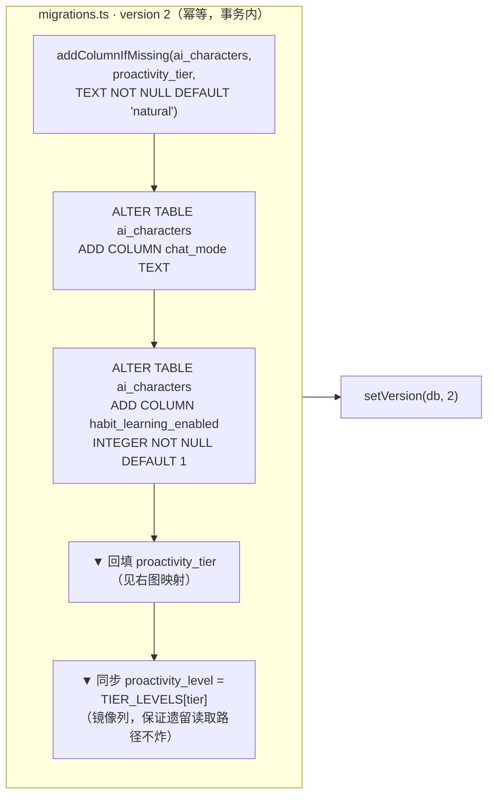

**回填映射**（6 个预设角色 + 现有数据统一走这条）：

| `proactivity_level` 区间 | → `proactivity_tier` | 现有预设命中 |
|---|---|---|
| `< 0.25` | `quiet` 安静 | — |
| `0.25 – 0.55` | `natural` 自然 | 0.35（沈屿）、0.4（顾言）、0.5（林晚） |
| `0.55 – 0.85` | `active` 活跃 | 0.6（阿哲）、0.65（团子）、0.7（晴夏） |
| `≥ 0.85` | `companion` 陪伴 | — |

> ⚠️ **已知语义损失**：`proactivityLevel` 是纯高低轴，而「陪伴」档（长时间未互动才关心）在旧模型里**无法表达**——旧值 0.65 既可能是"很主动"也可能是"陪伴型"。回填只能按数值分档，因此 **0.55–0.85 全部落 `active`**。
> **缓解**：迁移后首次进入「我们的空间」时，若该角色是迁移产生的，前端弹一次**一次性的等级确认卡**（4 个档位卡片 + 一句话说明），让用户自己选。不强制，可跳过（跳过则保持 `active`）。这是诚实处理，不是假装无损迁移。

**回滚方案**：`proactivity_level` 列保留原值副本（新增 `proactivity_level_legacy` 不需要——因为回填是**幂等的纯函数**，反向也能算回来）。若要回滚，改一行代码即可。

### 3.2 四档如何生效：**4 个正交旋钮，不是乘系数**

团队要求「要说明四档等级如何影响阈值，而不是简单乘系数」。我的方案是四个**互相独立**的旋钮：

| 旋钮 | 作用点 | 说明 |
|---|---|---|
| **① 阈值偏移 `thresholdShift`** | `send` 阈值 = `0.62 + shift` | 直接抬/降门槛 |
| **② 权重重分配 `weightMultipliers`** | 各因子权重 ×乘子后**重新归一化** | 改变"什么更重要" |
| **③ 空闲曲线 `idleCurve`** | `idleHours` 因子的饱和函数 | 「陪伴」档的核心差异在这里，不是权重 |
| **④ 否决参数 `vetoParams`** | `dailyLimit` / `minIntervalHours` / `allowedHours` | 硬上限 |

```ts
// server/config/defaults.ts
export const PROACTIVITY_TIERS = {
  quiet: {
    label: '安靜', desc: '盡量不主動打擾',
    levelMirror: 0.15,
    thresholdShift: +0.12,                       // ① send 阈值 0.62 → 0.74
    idleCurve: 'saturate48h',                    // ③ 要 48h 没聊才算「很久」
    weightMultipliers: {                         // ②
      idleHours: 0.6, userEmotionNeed: 1.2, topicContinuation: 0.5,
    },
    vetoParams: { dailyLimit: 1, minIntervalHours: 12, allowedHours: [11,12,13,14,15,16,17,18,19,20] }, // ④
  },
  natural: {
    label: '自然', desc: '根據情況偶爾主動',
    levelMirror: 0.50,
    thresholdShift: 0,
    idleCurve: 'saturate24h',
    weightMultipliers: {},                       // 全 ×1，即基础权重
    vetoParams: { dailyLimit: 3, minIntervalHours: 6, allowedHours: [9..22] },
  },
  active: {
    label: '活躍', desc: '更積極地主動開啟話題',
    levelMirror: 0.80,
    thresholdShift: -0.08,                       // ① 0.62 → 0.54
    idleCurve: 'saturate12h',                    // ③ 12h 就算很久
    weightMultipliers: {                         // ② 话题延续 + 时段权重上调
      idleHours: 1.2, topicContinuation: 1.3, timeOfDay: 1.4,
    },
    vetoParams: { dailyLimit: 5, minIntervalHours: 3, allowedHours: [8..23] },
  },
  companion: {
    label: '陪伴', desc: '你長時間沒互動時，適度主動關心',
    levelMirror: 0.65,
    thresholdShift: -0.04,
    // ★ ③ 这是「陪伴」档的灵魂：常规空闲几乎不给分，48h 后才陡峭上升
    idleCurve: 'companion48h72h',
    weightMultipliers: {                         // ② 情绪需求权重上调
      userEmotionNeed: 1.3, sharedContext: 1.2, topicContinuation: 0.8,
    },
    vetoParams: { dailyLimit: 3, minIntervalHours: 8, allowedHours: [9..23] },
  },
} as const;
```

**三条空闲曲线**（③ 的具体实现）：

```ts
function idleRaw(hours: number, curve: IdleCurve): number {
  switch (curve) {
    case 'saturate12h':       return Math.min(1, hours / 12);
    case 'saturate24h':       return Math.min(1, hours / 24);
    case 'saturate48h':       return Math.min(1, hours / 48);
    case 'companion48h72h':
      // 48h 前最多给 0.3（"不算久"），48h 后按 72h 饱和到 1.0
      return hours < 48 ? (hours / 48) * 0.3 : 0.3 + Math.min(1, (hours - 48) / 72) * 0.7;
  }
}
```

**② 权重归一化**（保证任何档位下总权重恒为 1，不会因乘子导致总分漂移）：

```ts
function resolveWeights(tier: ProactivityTier): Record<FactorKey, number> {
  const raw = {} as Record<FactorKey, number>;
  let sum = 0;
  for (const [key, base] of Object.entries(PROACTIVE_WEIGHTS_V2)) {
    const v = base * (PROACTIVITY_TIERS[tier].weightMultipliers[key] ?? 1);
    raw[key] = v;
    sum += v;
  }
  for (const key of Object.keys(raw)) raw[key] = raw[key] / sum;   // 归一化
  return raw;
}
```

**效果对照**（归一化后 `idleHours` 与 `userEmotionNeed` 的实际权重）：

| 档位 | idleHours | userEmotionNeed | send 阈值 | 24h 未互动的 idle 得分 | 72h 未互动的 idle 得分 |
|---|---|---|---|---|---|
| 安静 | 0.117 | 0.234 | **0.74** | 0.50 | 1.00 |
| 自然 | 0.200 | 0.180 | 0.62 | 1.00 | 1.00 |
| 活跃 | 0.227 | 0.170 | **0.54** | 1.00 | 1.00 |
| 陪伴 | 0.202 | 0.234 | 0.58 | **0.15** | **1.00** |

→ 「陪伴」档在 24h 未互动时几乎不触发（0.15），但 72h 未互动时拿满分。**这正是 V2-6 要的「长时间未互动时才适度主动关心」，且完全不靠乘系数实现。**

### 3.3 主动决策：7 因子 → 10 因子（V2-5 严格 1:1 映射）

| # | V2-5 判断依据 | factor key | 计算方式 | 基础权重 |
|---|---|---|---|---|
| 1 | 最近聊天内容 | `topicContinuation` | 48h 内有延续点 0.75；`recent_topics` 非空 0.85；命中 `topic_interest` 偏好 0.9；否则 0.3 | **0.10** |
| 2 | 最近互动时间 | `idleHours` | `idleRaw(idleHours, tier.idleCurve)` | **0.20** |
| 3 | 用户近期语言变化 | `languageShift` | 🆕 来自 `emotion_trend_snapshots`：近 3 天 vs 前 3 天的 `Δvalence` + `ΔavgChars` + `ΔmessageCount`，加权后 clamp 到 0..1 | **0.08** |
| 4 | 用户当前情绪倾向 | `userEmotionNeed` | 沿用 V1：severe=1 / needsComfort=0.75 / valence<−0.15=0.6 / valence>0.3=0.35 / else 0.2 | **0.18** |
| 5 | AI 当前状态 | `aiEmotion` | 沿用 V1：caring=0.8 / worried=0.7 / happy·excited=0.6 / sad·down=0.25 / else 0.3 | **0.06** |
| 6 | 用户设置的主动程度 | `proactivityTier` | `TIER_LEVELS[tier]`（0.15 / 0.50 / 0.80 / 0.65） | **0.14** |
| 7 | 历史主动消息频率 | `recentProactiveLoad` | 🆕 **反向因子**：`1 − min(1, last7DaysSent / (dailyLimit × 7))`。防骚扰 | **0.06** |
| 8 | 最近是否已经主动联系过 | `sinceLastProactive` | 🆕 `min(1, minutesSinceLastProactive / (minIntervalHours × 60 × 3))`；从未发过 → 0.8 | **0.07** |
| 9 | 当前时间是否适合打扰 | `timeOfDay` | 沿用 V1 时段曲线（19–22: 1.0 / 12–14: 0.8 / 8–11: 0.6 / 其他 0.35） | **0.07** |
| 10 | 最近共同经历和记忆 | `sharedContext` | 🆕 近 7 天有新 story(+0.4) / 有 importance≥0.8 新 memory(+0.3) / 有新 active habit(+0.3)，clamp 0..1 | **0.04** |
| | | | **合计** | **1.00** |

### 3.4 硬否决：V1–V11 → V1–V14

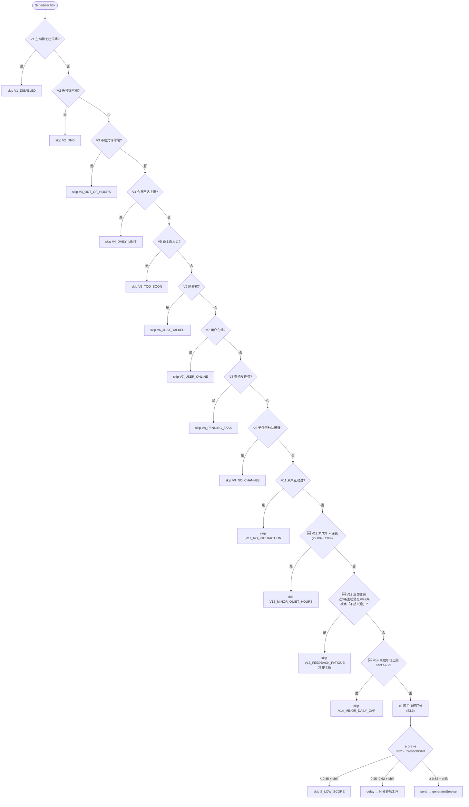

> 注：**V10 在 V1 中就是跳号**（现有代码为 V1–V9 + V11），本次保留空缺，不复用，避免历史 reason_code 含义漂移。

**新增 3 项否决的理由**：

| Code | 对应需求 | 理由 |
|---|---|---|
| `V12_MINOR_QUIET_HOURS` | V2-13 未成年保护 | 未成年用户在深夜一律不主动触达，这是**硬红线**，不因分数高而破例 |
| `V13_FEEDBACK_FATIGUE` | V2-14 反馈进后端 | 让「不感兴趣」**真的有用**：连续被嫌弃就冷静 72 小时。否则反馈按钮就是假按钮（V2-11） |
| `V14_MINOR_DAILY_CAP` | V2-13 不制造依赖 | 未成年每日主动消息上限 2 条，且**用户无法调高**（覆盖 `vetoParams.dailyLimit`） |

---

## 4. 重构方案：聊天模式 / 人格隔离

### 4.1 顶层决策：不替换 `StrategyType`，另立 `ChatMode`

**为什么不能把 9 种模式直接塞进 `StrategyType`**：

现有 `STRATEGY_TYPES` 有 8 个值，其中 `crisis_care`（危机陪伴）与 `blocked`（安全拦截）是**系统专用**——它们必须在任何用户选择之上生效。如果把 `StrategyType` 换成 9 个用户模式，这两条就消失了，安全底线被用户选择覆盖。**这是不可接受的。**

```mermaid
graph TB
    subgraph CM["ChatMode（用户可选，存 ai_characters.chat_mode）"]
        CM0["auto<br/>AI 自選"]
        CM1["normal_chat 普通聊天"]
        CM2["listening 傾聽"]
        CM3["comfort 安慰"]
        CM4["encouragement 鼓勵"]
        CM5["organize_thoughts 整理想法 🆕"]
        CM6["study_buddy 學習陪伴 🆕"]
        CM7["share_joy 分享開心 🆕"]
        CM8["quiet_company 安靜陪伴 🆕"]
        CM9["story_chat 故事聊天 🆕"]
    end
    subgraph ST["StrategyType（内部，共 13 个）"]
        subgraph SYS["系统专用（不可被用户覆盖）"]
            S1["crisis_care"]
            S2["blocked"]
            S3["topic_change"]
        end
        subgraph USR["由 ChatMode 派生（9 个）"]
            T1["normal_chat"]:::keep
            T2["listening"]:::keep
            T3["comfort"]:::keep
            T4["encouragement"]:::keep
            T5["organize_thoughts"]:::new
            T6["study_buddy"]:::new
            T7["share_joy"]:::new
            T8["quiet_company"]:::new
            T9["story_chat"]:::new
        end
        subgraph LEG["仅 AI 自选时使用"]
            L1["companionship（旧「陪伴」）"]
        end
    end
    CM0 -.->|AI 自选，可产出| S1 & S2 & S3 & L1 & T1 & T2 & T3 & T4
    CM1 --> T1
    CM2 --> T2
    CM3 --> T3
    CM4 --> T4
    CM5 --> T5
    CM6 --> T6
    CM7 --> T7
    CM8 --> T8
    CM9 --> T9
    classDef keep fill:#E8F5E9,stroke:#4CAF50
    classDef new  fill:#FFF3E0,stroke:#FF9800
```

**现有 6 种 AI 自选策略与 9 种模式的对应关系**：

| V2-8 模式 | 现有 strategy | 处置 |
|---|---|---|
| 普通聊天 | `normal_chat` | ✅ 直接复用 |
| 倾听 | `listening` | ✅ 直接复用 |
| 安慰 | `comfort` | ✅ 直接复用 |
| 鼓励 | `encouragement` | ✅ 直接复用 |
| **安静陪伴** | ~~`companionship`~~ | ⚠️ 语义接近但不相同。V1 的 `companionship` 是「想有人陪着」的**被动响应**；V2-8 的「安静陪伴」是「表达我在，不施压」的**主动姿态**。→ **新增 `quiet_company`，保留 `companionship` 供 AI 自选**，避免污染已验证的 V1 行为 |
| 整理想法 | — | 🆕 新增 |
| 学习陪伴 | — | 🆕 新增 |
| 分享开心 | — | 🆕 新增 |
| 故事聊天 | — | 🆕 新增 |

### 4.2 共存规则：优先级链

```
┌─ 优先级链（strategyService.pickStrategy，自上而下，命中即返回）──────────┐
│                                                                          │
│  1. crisisSignal === 'severe'        → crisis_care      🔒 不可被用户覆盖 │
│  2. 入方向安全拦截 (blocked)          → blocked          🔒 不可被用户覆盖 │
│  3. chatMode !== 'auto'              → CHAT_MODE_TO_STRATEGY[chatMode]    │
│     └─ 用户主权：不再走 AI 自选，也不因 wantsTopicChange 而切换           │
│        （用户明确选了「倾听」，就不要自作主张换话题）                      │
│  4. chatMode === 'auto'              → 现有 AI 自选链（扩展版）           │
│     crisis → blocked → topic_change → comfort → listening                 │
│     → encouragement → companionship → share_joy? → normal_chat            │
│  5. 连续重复保护：                                                        │
│     - auto 模式：MAX_REPEAT = 3（沿用 V1），超限降级为 normal_chat        │
│     - 用户选定模式：MAX_REPEAT = 6，且降级目标**仍是该模式**              │
│       （只在 L7 追加「換個說法」提示，不切走——用户主权优先）              │
└──────────────────────────────────────────────────────────────────────────┘
```

**关键设计：用户选了模式，但用户正在难过怎么办？**

不静默覆盖，也不无视情绪。做法是**让模式去适配情绪，而不是被情绪覆盖**：

| 模式 | 用户难过时的表现（不是切到 comfort，而是用该模式的方式接住） |
|---|---|
| 鼓励 | 「先承认处境不易」→「给一个**今天就能做的最小一步**」，而不是空喊加油 |
| 倾听 | 「少评价多回应」+「问一个具体的细节」，不急于给建议 |
| 故事聊天 | 用一个温柔的意象/比喻接住情绪，不分析 |
| 学习陪伴 | 「先关心人再关心事」：一句「先休息一下也可以」，然后回到学习 |

这在 Prompt 层由 **L7 的「情绪绑定段」**实现（见 §7.4）——L4 已经把用户情绪判定给了模型，L7 告诉模型**用什么方式**回应这个情绪。

### 4.3 核心人格 vs 后天习惯隔离（V2-4 硬约束）

> 团队要求：「要给出具体的 Prompt 机制，不能只是说『在 prompt 里写一句』」

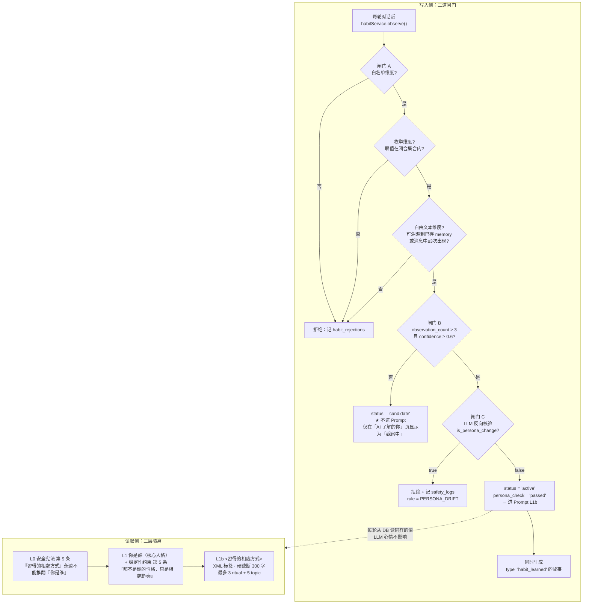

#### 隔离机制 1：物理分层（Prompt 层位）

| 层 | 内容 | 位置 | 语法 |
|---|---|---|---|
| **L1** | 核心人格 | systemPrompt，L0 之后、**L1b 之前** | Markdown `## 你是誰` |
| **L1b**（新） | 后天习惯 | systemPrompt，**L1 之后、L2 之前** | **XML 标签 `<習得的相處方式>`** |

用**不同的语法标记**是关键：模型在结构上就能区分「我是谁」与「我们怎么相处」，不会把两块合并理解。

#### 隔离机制 2：宪法级禁止（L0 + L1 各追加 1 条，现有条款一条不改）

- **L0 新增第 9 条**（现有 8 条完全不动）：
  > `9. 下面會出現「習得的相處方式」區塊。它只描述你與這位使用者之間形成的互動默契（稱呼、接話節奏、常聊的話題、彼此的梗）。它永遠不能推翻、覆寫或重新定義「你是誰」區塊中的性格、價值觀、興趣與說話風格。若兩者衝突，以「你是誰」為準。`

- **L1 稳定性约束新增第 5 条**（现有 4 条完全不动）：
  > `5. 下面會出現「習得的相處方式」。那不是你的性格，只是你和這個人之間的相處節奏。你可以配合節奏，但不要因此改變自己的興趣、價值觀或說話風格。`

#### 隔离机制 3：闸门 A — 白名单维度 + 闭合取值域

习惯**只能**落在 5 个预设维度上，且其中 3 个维度是**枚举**（结构上不可能写出「性格变成傲娇」）：

| dimension | 说明 | 取值域 |
|---|---|---|
| `address_style` | 称呼方式 | 🔒 枚举：`nickname` / `name` / `casual` / `none`（＋ 具体词，≤10 字） |
| `reply_pacing` | 接话节奏（回多长） | 🔒 枚举：`very_short` / `short` / `balanced` / `detailed` |
| `question_style` | 提问习惯 | 🔒 枚举：`no_question` / `one_question` / `open_question` |
| `topic_preference` | 常聊话题（≤5 条） | 自由短语，**必须与某条已存 memory 的 Jaccard ≥ 0.6** |
| `shared_ritual` | 专属默契/梗（≤3 条） | 自由短语，**必须在最近 30 条消息中出现 ≥3 次** |

#### 隔离机制 4：闸门 B — 置信度累积（防止「每次聊天随机变化」）

- `observation_count ≥ 3` 且 `confidence ≥ 0.6` 才 `status='active'` 进 Prompt。
- 未达标的是 `candidate`，**不进 Prompt**，只在「AI 了解的你 / AI 习惯」页显示「觀察中」。
- `confidence` **只单调上升**（每次观测 `confidence += (1 - confidence) * 0.2`）；`miss_count ≥ 5` 才降级（用户确认过的除外）。
- 用户可手动**确认 / 编辑 / 删除**任何一条 → `user_confirmed=1` 的条目直接 active 且永不自动降级。

> 这一条同时满足了 V2-4 的「AI 人格不能每次聊天随机变化」——习惯是**从 DB 读的持久值**，不是 LLM 每轮重新发明的。

#### 隔离机制 5：闸门 C — LLM 反向一致性校验（具体可执行）

每次 LLM 提出 habit 候选时，`habitService` 发一次**轻量 LLM 调用**（用 `XULIAN_LIGHT_MODEL`，超时 30s）：

```
你是人格一致性檢查器。
以下是一條關於 AI 與使用者相處方式的描述。
它是否試圖改變 AI 的「性格、價值觀、興趣或說話風格」，
而不只是描述「互動節奏、稱呼、接話方式、共同話題」？

描述：{candidate.value_label}
AI 的核心人格：{character.personality}

只輸出 JSON：{"is_persona_change": <bool>, "reason": "<20字內>"}
```

命中 `is_persona_change: true` → **拒绝写入** + 写 `safety_logs`（`rule='PERSONA_DRIFT'`, `direction='outgoing'`, `action='blocked'`）。
LLM 调用失败 → **保守拒绝**（fail-closed，宁可不记也不冒险）。

#### 隔离机制 6：架构级硬约束 — 重置不影响人格

```ts
// server/services/habitService.ts
// ⛔ 架构硬约束：本文件**禁止** import 'server/db/repositories/characters.repo.ts'
//    的 update/updateProactivity 等写入函数。
//    核心人格字段（personality / personalityTags / speakingStyle / interests /
//    likedTopics / dislikedTopics）只能由 personaService.update() 修改，
//    而它只能由用户在角色编辑页触发。
//    resetHabits() 只 UPDATE ai_habits SET status='archived'，绝不触碰 ai_characters。
```

这条会写进 `habitService.ts` 的文件头注释，并在 T06 的验收里做 **grep 静态检查**。

---

## 5. 新增服务清单

### 5.1 服务全景（增量部分）

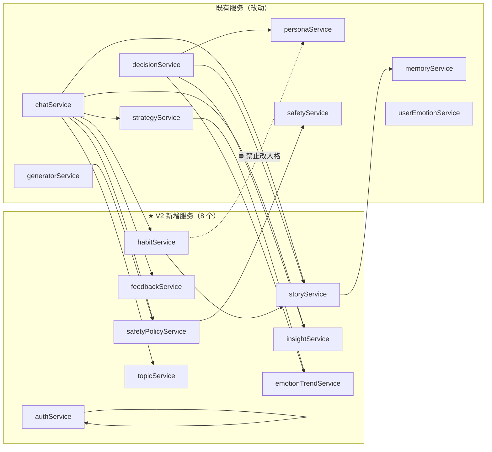

### 5.2 服务职责与关键签名

| # | 服务 | 文件 | 职责 | 依赖 |
|---|---|---|---|---|
| 1 | **AuthService** | `server/services/authService.ts` | 注册 / 登录 / 登出 / 会话签发与校验 / 密码杂凑 / 匿名账号绑定 | `node:crypto`, `users.repo`, `auth.repo` |
| 2 | **StoryService** | `server/services/storyService.ts` | 故事自动生成（规则 + LLM）、CRUD、溯源、归档 | `stories.repo`, `sdkClient`, `safetyService`, `memoryService` |
| 3 | **HabitService** | `server/services/habitService.ts` | AI 后天习惯观测、置信度累积、一致性校验、Prompt 注入、重置 | `habits.repo`, `sdkClient`, `storyService`, `memories.repo` |
| 4 | **InsightService** | `server/services/insightService.ts` | 「AI 了解的你」偏好学习、CRUD、去重 | `insights.repo`, `sdkClient`, `memories.repo` |
| 5 | **EmotionTrendService** | `server/services/emotionTrendService.ts` | 日快照聚合、**定性描述派生**（禁止数字）、策略提示生成 | `trend.repo`, `states.repo`, `conversations.repo` |
| 6 | **FeedbackService** | `server/services/feedbackService.ts` | 消息反馈/举报落库、触发安全日志、疲劳检测 | `feedback.repo`, `safetyPolicyService`, `conversations.repo` |
| 7 | **SafetyPolicyService** | `server/services/safetyPolicyService.ts` | **统一安全策略层**：规则编排、未成年保护、分级响应 | `safety.repo`, `users.repo`, `safetyService` |
| 8 | **TopicService** | `server/services/topicService.ts` | 聊天主题抽取（写入 `conversations.recent_topics`） | `sdkClient`, `conversations.repo` |

### 5.3 关键函数签名

```ts
// ── 1. authService ────────────────────────────────────────────
export const authService = {
  /** 密码杂凑：scryptSync(N=16384,r=8,p=1)，返回自描述串 */
  hashPassword(password: string): string;
  /** 常数时间比对 */
  verifyPassword(password: string, stored: string): boolean;

  /** 注册。attachUserId 非空时复用该匿名账号 → 老用户零数据迁移 */
  register(input: {
    email: string; password: string; displayName?: string;
    birthDate?: string | null; attachUserId?: string;
  }): { user: User; session: SessionToken };
  login(input: { email: string; password: string; userAgent?: string; ip?: string })
    : { user: User; session: SessionToken };
  logout(token: string): void;
  logoutAll(userId: string): number;
  /** 验签 + 查库；返回 null 表示无效/过期/已吊销 */
  verifySession(token: string): { userId: string; sessionId: string } | null;
  changePassword(userId: string, oldPassword: string, newPassword: string): void;
};

// ── 2. storyService ───────────────────────────────────────────
export const storyService = {
  /** 确定性规则型：第一次聊天 */
  ensureFirstChatStory(userId: string, characterId: string, messageId: string): Story | null;
  /** LLM 判定型：user_shared / shared_milestone。触发条件见 §5.4 */
  considerExtract(input: StoryExtractInput): Promise<Story | null>;
  /** 由 habit 联动产生 */
  createFromHabit(userId: string, characterId: string, habit: AiHabit): Story;
  /** 用户手动保存 / 创建 */
  createByUser(userId: string, characterId: string, input: { title: string; summary: string;
    sourceMessageIds?: string[]; happenedAt?: string }): Story;
  list(userId: string, opts: { characterId?: string; type?: StoryType; limit?: number }): Story[];
  get(userId: string, storyId: string): Story;             // 越权抛 E_FORBIDDEN
  update(userId: string, storyId: string, patch: StoryPatch): Story;  // 置 is_user_edited=1
  remove(userId: string, storyId: string): void;           // 软删除 deleted_at
  restore(userId: string, storyId: string): Story;         // 还原为 auto_* 版本
};

// ── 3. habitService ───────────────────────────────────────────
export const habitService = {
  /** 每轮对话后观测（异步容错，失败不影响回复） */
  observe(input: HabitObserveInput): Promise<void>;
  /** 取进 Prompt 的 active 习惯（≤3 ritual + ≤5 topic + 3 个枚举维度各 1） */
  activeForPrompt(userId: string, characterId: string): AiHabit[];
  /** ★ 编译进 Prompt L1b，硬截断 300 字 */
  renderHabitBlock(habits: AiHabit[]): string;
  list(userId: string, opts: { characterId: string; includeCandidate?: boolean }): AiHabit[];
  update(userId: string, habitId: string, patch: { value?: string; userConfirmed?: boolean }): AiHabit;
  remove(userId: string, habitId: string): void;
  /** ★ 只归档 ai_habits，绝不触碰 ai_characters */
  resetAll(userId: string, characterId: string): number;
};

// ── 4. insightService ─────────────────────────────────────────
export const insightService = {
  observe(input: InsightObserveInput): Promise<void>;
  /** 双轨查询：全域（scope=''）+ 角色覆盖 */
  activeForPrompt(userId: string, characterId: string): UserInsight[];
  list(userId: string, opts: { characterId?: string }): UserInsight[];
  update(userId: string, insightId: string, patch: { value?: string; reason?: string }): UserInsight;
  remove(userId: string, insightId: string): void;
};

// ── 5. emotionTrendService ────────────────────────────────────
export const emotionTrendService = {
  /** 幂等 upsert 某天快照（每轮聊天后异步调用） */
  upsertSnapshot(userId: string, characterId: string, day: string): void;
  /** ★ 纯函数：只输出预定义常量表中的定性文案，类型里不含数字 */
  describe(snapshots: TrendSnapshot[]): TrendDescription[];
  /** 生成注入 L4 的策略提示（定性文案，非数字） */
  toStrategyHint(descriptions: TrendDescription[]): string | null;
  /** 供决策因子 #3 languageShift 使用的内部数值（0..1），不下发给前端 */
  languageShiftScore(userId: string, characterId: string): number;
  /** 画图数据：-2..2 整数档位 + 文字标签，无百分比 */
  chart(userId: string, characterId: string, days: number): TrendPoint[];
};

// ── 6. feedbackService ────────────────────────────────────────
export const feedbackService = {
  submit(userId: string, messageId: string, input: { kind: FeedbackKind; reason?: string })
    : MessageFeedback;
  remove(userId: string, messageId: string, kind: FeedbackKind): void;
  listByMessage(userId: string, messageId: string): MessageFeedback[];
  /** 供 V13_FEEDBACK_FATIGUE 使用 */
  countNegativeOnProactive(userId: string, characterId: string, lastN: number): number;
  summary(userId: string): { total: number; byKind: Record<FeedbackKind, number> };
};

// ── 7. safetyPolicyService ────────────────────────────────────
export const safetyPolicyService = {
  /** 统一入口：所有方向的安全检查都走这里 */
  evaluate(input: {
    userId: string; characterId: string; text: string;
    direction: 'incoming' | 'outgoing' | 'proactive';
    context?: { messageId?: string; conversationId?: string };
  }): PolicyDecision;
  /** 未成年保护：主动消息时段 / 日上限 / 更严的入方向阈值 */
  minorGuard(userId: string): { isMinor: boolean; quietHours: [number, number]; dailyCap: number };
  /** 举报 → 落 safety_logs（source='user_report'）+ 标记待处理 */
  report(userId: string, messageId: string, reason: string): MessageFeedback;
};

// ── 8. topicService ───────────────────────────────────────────
export const topicService = {
  /** 抽取并写入 conversations.recent_topics（≤5 个，覆盖式） */
  refresh(userId: string, conversationId: string): Promise<string[]>;
  /** 取最近主题（供「我们的空间」与决策因子 #1） */
  recent(userId: string, characterId: string): string[];
};
```

### 5.4 故事自动生成的触发规则（真实后端，非假数据）

| 类型 | 触发方式 | 是否用 LLM | 说明 |
|---|---|---|---|
| `first_chat` | `countUserMessages(userId, characterId) === 1` | ❌ 纯规则 | 100% 确定，新用户第一条消息后必然生成 |
| `user_saved` | 用户在故事页/记忆页点「保存到我们的故事」 | ❌ 纯规则 | 用户主权 |
| `habit_learned` | habit 从 `candidate` → `active` | ❌ 纯规则 | 由 `habitService` 联动调用 |
| `special_interaction` | `shared_ritual` 类 habit 被确认为 active | ❌ 纯规则 | 与 `habit_learned` 类型不同（强调"默契/梗"） |
| `user_shared` | 满足触发条件后由 LLM 判定 | ✅ | 触发条件：`shareDepth ≥ 0.6` **或** 本轮新增了 `event`/`habit` 类记忆 **或** `intensity ≥ 0.7` |
| `shared_milestone` | 同上 | ✅ | 同上，LLM 二选一 |

**`considerExtract` 的三道防线**：

1. `memoryService.containsSensitive(text)` 命中 → **不生成**（V2-2「AI 不得私自永久保存敏感信息」）
2. LLM 输出必须带 `source_message_ids`（从本轮消息里选），为空则丢弃 → 保证**可追溯**
3. 生成后再过一遍 `safetyService.checkOutgoing()` → 命中红线直接丢弃（沿用 `generatorService` 的做法）

---

## 6. API 增量清单

### 6.1 新增端点（24 个）

#### 认证（5）

| 方法 | 路径 | 说明 | 鉴权 |
|---|---|---|---|
| POST | `/api/auth/register` | 注册。body 含 `attachUserId` 时复用匿名账号（老用户零迁移） | 无 |
| POST | `/api/auth/login` | 登录 | 无 |
| POST | `/api/auth/logout` | 登出当前会话 | Bearer |
| GET | `/api/auth/me` | 当前账号 + 会话信息 | Bearer |
| PATCH | `/api/auth/password` | 修改密码（修改后吊销其他会话） | Bearer |

#### 我们的故事（6）

| 方法 | 路径 | 说明 |
|---|---|---|
| GET | `/api/stories` | `?characterId=&type=&limit=&offset=` |
| GET | `/api/stories/:id` | 详情（含 `sourceMessageIds` 溯源） |
| POST | `/api/stories` | 用户手动创建（`type=user_saved`） |
| PATCH | `/api/stories/:id` | 改标题/摘要 → 置 `is_user_edited=1` |
| DELETE | `/api/stories/:id` | 软删除 |
| POST | `/api/stories/:id/restore` | 还原为自动生成版本 |

#### AI 了解的你（4）

| 方法 | 路径 | 说明 |
|---|---|---|
| GET | `/api/insights` | `?characterId=` 返回全域 + 角色覆盖，含 `status`（candidate 显示「觀察中」） |
| PATCH | `/api/insights/:id` | 用户修改（→ `is_user_edited=1`, `source='user'`） |
| DELETE | `/api/insights/:id` | 删除 |
| POST | `/api/insights/:id/confirm` | 用户确认 → 直接 active |

#### AI 后天习惯（4）

| 方法 | 路径 | 说明 |
|---|---|---|
| GET | `/api/habits` | `?characterId=&includeCandidate=true` |
| PATCH | `/api/habits/:id` | 修改 / 确认 |
| DELETE | `/api/habits/:id` | 删除 |
| POST | `/api/habits/reset` | **清空后天习惯**（不影响核心人格） |

#### 反馈与举报（3）

| 方法 | 路径 | 说明 |
|---|---|---|
| POST | `/api/messages/:id/feedback` | body `{kind, reason?}`；`kind=report` 时 `reason` 必填 |
| DELETE | `/api/messages/:id/feedback` | 撤销，`?kind=` |
| GET | `/api/feedback/summary` | 我的反馈统计 |

#### 情绪趋势（2）

| 方法 | 路径 | 说明 |
|---|---|---|
| GET | `/api/emotion-trend` | `?characterId=&days=14` → `{points, descriptions, dataSufficient, disclaimer}` |
| GET | `/api/emotion-trend/policy` | 固定免责声明文案（前端展示用） |

#### 聚合与元数据（3）

| 方法 | 路径 | 说明 |
|---|---|---|
| GET | `/api/space/overview` | 「我们的空间」一次性聚合（避免前端发 8 个请求） |
| GET | `/api/chat-modes` | 9 种模式列表 + 说明（前端渲染模式选择器） |
| GET | `/api/proactivity-tiers` | 4 档等级列表 + 说明 |

#### 安全（1）

| 方法 | 路径 | 说明 |
|---|---|---|
| GET | `/api/safety/policy` | 当前生效的安全策略摘要（含未成年保护状态，供设置页展示） |

> 举报**不单独开端点**，作为 `feedback.kind='report'` 处理，由 `feedbackService` 自动落 `safety_logs`（`source='user_report'`）。减少一张表 + 一个端点。

### 6.2 改动端点（6 个）

| 方法 | 路径 | 改动 |
|---|---|---|
| PATCH | `/api/characters/:id` | 新增接受 `proactivityTier` / `chatMode` / `habitLearningEnabled` |
| GET | `/api/proactive/status` | 因子从 7 → 10；新增 `tier` / `thresholdApplied` 字段 |
| GET | `/api/proactive/dry-run` | 同上；新增 `?simulateTier=` 调试参数 |
| POST | `/api/chat/stream` | body 新增可选 `chatMode`（临时覆盖角色设置，仅本轮） |
| POST | `/api/users/bootstrap` | 新增返回 `hasPassword` / `isMinor`；未登录时仍可用（匿名模式） |
| DELETE | `/api/users/:userId/data` | 需显式清理 `message_feedback`（无外键级联）+ `user_auth` / `sessions` |

### 6.3 情绪趋势 API 的合规设计（V2-7「禁止百分比分数」）

```ts
// 类型层面堵死：TrendDescription 里没有任何数字字段
export interface TrendDescription {
  key: 'shorter_replies' | 'longer_replies' | 'tone_shift'
     | 'more_negative'   | 'more_positive'
     | 'less_frequent'   | 'more_frequent';
  text: string;                        // 来自预定义常量表 TREND_TEXTS，非 LLM 生成
  strength: 'slight' | 'noticeable';
}

// 画图数据：-2..2 整数档位，不是百分比，不是 0..1 分数
export interface TrendPoint {
  day: string;
  level: -2 | -1 | 0 | 1 | 2;
  levelLabel: '比較低落' | '稍微低落' | '差不多' | '比較好' | '好一些';
  messageCount: number;                // 条数是客观事实，不是评估分数
}

export interface TrendResponse {
  range: { from: string; to: string };
  points: TrendPoint[];
  descriptions: TrendDescription[];    // ≤3 条
  dataSufficient: boolean;             // 数据不足 → 前端显示「再多聊幾天，我才看得出變化」
  disclaimer: string;                  // 固定：'這只是聊天語氣的粗略觀察，不是心理評估，也不能取代專業協助。'
}
```

**三重保证**：
1. `describe()` 的输出**只能**是 `TREND_TEXTS` 常量表中的条目 → 不可能出现「抑郁指数 87%」。
2. `TrendDescription` 类型**不含数字字段** → 前端拿不到分数，编译期就堵死。
3. 前端 Y 轴**只画 5 档文字标签**，不标数字；hover 只显示档位文字 + 消息条数。

---

## 7. Prompt 架构扩展方案（L0–L8）

### 7.1 原则：**只追加，不删除，不重排**

现有 8 层的**每一条现有内容一个字都不改**。所有扩展都是：
- 在**层尾追加条款**（L0 第 9 条、L1 第 5 条）
- 在**层间插入新层**（L1b）
- 在**层内追加可选段**（L4 趋势行、L5 故事引用、L7 模式来源/情绪绑定/长度提示）

### 7.2 逐层变更表

| 层 | 位置 | 现状 | V2 变更 | 风险 | 开关 |
|---|---|---|---|---|---|
| **L0** | system | 8 条硬约束 | **+ 第 9 条**（后天习惯不覆盖核心人格）<br>**+ L0b 未成年保护段**（`isMinor` 时条件注入）<br>第 3 条措辞强化（明确禁止任何形式的情绪评分） | 🟢 低（纯追加） | `PROMPT_V2_FLAGS.habitLayer`<br>`PROMPT_V2_FLAGS.minorGuard` |
| **L1** | system | 4 条稳定性约束 | **+ 第 5 条**（区分"你是谁"与"相处节奏"）<br>前 4 条一字不改 | 🟢 低 | `PROMPT_V2_FLAGS.habitLayer` |
| **L1b** 🆕 | system（L1 后、L2 前） | — | `<習得的相處方式>` XML 块。仅含 5 个白名单维度的枚举/已验证文本，**硬截断 300 字**，最多 3 ritual + 5 topic + 3 个枚举维度各 1 条 | 🟡 中（新增层，可能冲淡 L1） | `PROMPT_V2_FLAGS.habitLayer` |
| **L2** | system | 3 段 | 不变 | — | — |
| **L3** | system | — | 不变 | — | — |
| **L4** | user turn | 5 字段 | **+ 趋势提示行**（条件注入，来自 `emotionTrendService.toStrategyHint()`，是**预定义定性文案**） | 🟢 低 | `PROMPT_V2_FLAGS.trendInUserState` |
| **L5** | user turn | `[m1]..[mN]` | **+ 故事引用** `[s1]..[sN]`（≤3 条，复用「不要一次全說完」的措辞） | 🟡 中（增 token，且要防模型一次全说） | `PROMPT_V2_FLAGS.storyInMemory` |
| **L6** | user turn | 摘要 + 最近 20 条 | 不变 | — | — |
| **L7** | user turn | label + hint + 禁用 | **重构为 4 段**：模式来源行 / `hint` / **情绪绑定段** 🆕 / **长度提示** 🆕 + 禁用语。`STRATEGY_META` 扩到 13 项，`STRATEGY_FORBIDDEN` 补 5 项 | 🔴 **高**（V2-8 硬约束的落地点） | `PROMPT_V2_FLAGS.modeLayer` |
| **L8** | system | 4 条 | **+ 模式化长度覆盖**（安静陪伴强制 1–2 句；整理想法允许分段） | 🟢 低 | `PROMPT_V2_FLAGS.modeLayer` |

### 7.3 单一数据源改造（关键：让"加一个模式"只改 1 处）

现在加一个模式要动 5 个地方（`STRATEGY_TYPES` / `STRATEGY_META` / `STRATEGY_FORBIDDEN` / `STRATEGY_USER_LABELS` / `prompts.ts`）。改造为**注册表 + 派生**：

```ts
// shared/constants.ts
export interface ChatModeSpec {
  mode: ChatMode;
  label: string;                 // 繁中展示名
  desc: string;                  // 模式选择器的说明
  strategy: StrategyType | null; // 'auto' 为 null
  hint: string;                  // L7 行为指令
  emotionBinding: string;        // L7 情绪绑定模板，{emotionLabel} 占位
  lengthHint: string | null;     // L8 长度覆盖，null = 沿用角色设置
  forbidden: string[];           // L7 禁用语
}

/** ★ 单一数据源：新增聊天模式只改这里 */
export const CHAT_MODE_REGISTRY: Record<ChatMode, ChatModeSpec> = { /* 10 项 */ };

/** 系统专用策略（crisis_care / blocked / topic_change / companionship）单独定义 */
const SYSTEM_STRATEGIES: Record<SystemStrategy, Omit<ChatModeSpec,'mode'|'strategy'>> = { /* 4 项 */ };

// ── 以下全部派生，现有 import 名与形状保持不变 → 不破坏任何现有代码 ──
export const CHAT_MODES = Object.keys(CHAT_MODE_REGISTRY) as ChatMode[];
export const STRATEGY_TYPES = [...SYSTEM_STRATEGY_KEYS, ...modeStrategies] as const;
export type StrategyType = (typeof STRATEGY_TYPES)[number];
export const STRATEGY_META: Record<StrategyType, StrategyMeta> = { /* 合并派生 */ };
export const STRATEGY_FORBIDDEN: Record<StrategyType, string[]> = { /* 合并派生 */ };
export const STRATEGY_USER_LABELS: Record<StrategyType, string> = { /* 合并派生 */ };
export const CHAT_MODE_TO_STRATEGY: Record<Exclude<ChatMode,'auto'>, StrategyType> = { /* 派生 */ };
```

→ **对现有代码完全向后兼容**（`STRATEGY_TYPES` / `STRATEGY_META` / `STRATEGY_FORBIDDEN` 的导出名和类型形状都不变），同时满足 V2-12「不得写死」。

### 7.4 L7 层改造详情

**改造前**（`buildStrategyLayer(strategy, userText)`）：

```
<本輪策略>{label}
{hint}

禁用：
{forbidden}
</本輪策略>
```

**改造后**（`buildStrategyLayer(ctx)`）：

```
<本輪策略>
【模式來源】{使用者選定：{modeLabel}　← 使用者自己選的，本輪就照這個方式回} 
          {AI 依當下狀況選擇：{modeLabel}}
{hint}

{emotionBinding}
{lengthHint}

禁用：
{forbidden}
</本輪策略>
```

**9 种模式的 `hint` / `emotionBinding` / `lengthHint` 定义**（V2-8「必须真正改变 AI 回复策略」的落地点）：

| 模式 | hint（行为指令） | emotionBinding（情绪绑定模板） | lengthHint |
|---|---|---|---|
| 普通聊天 | 自然接話，不刻意昇華，不總結 | 使用者現在{emotionLabel}。順著他的語氣接，不用特別處理。 | null（沿用角色） |
| 傾聽 | 少評價多回應。先複述你聽到的，再問一個**具體的細節**（不是「怎麼會這樣」這種空問） | 使用者現在{emotionLabel}。不要急著安慰或給建議，先把話接住。 | null |
| 安慰 | 先承認處境確實不容易，再陪著。禁止空泛鼓勵 | 使用者現在{emotionLabel}。先說一句「這確實不好受」，再陪著，不要試圖解決。 | null |
| 鼓勵 | 給出**具體、今天就能做的最小一步**，不要空喊加油 | 使用者現在{emotionLabel}。先體認他的處境，再給一個真的很小的下一步。 | null |
| 整理想法 | 幫他把混亂的思路拆開：先複述你聽到的幾個點，再問哪一個最卡。可以用條列，但保持口語 | 使用者現在{emotionLabel}。不要安慰，幫他把事情理清楚。 | 可以分段，總長可比平時長 |
| 學習陪伴 | 陪讀/陪學。不打擾專注：不主動開新話題，回應要短，他問才答 | 使用者現在{emotionLabel}。保持安靜陪伴的狀態，不要把他拉去聊天。 | 一到兩句話，最多 30 字 |
| 分享開心 | 接住好事，一起高興。先問細節（「然後咧？」），再表達你真的替他開心 | 使用者現在{emotionLabel}。跟著他的開心走，不要潑冷水也不要說教。 | null |
| 安靜陪伴 | 表達「我在」就好。不問問題，不要求回覆，不給建議 | 使用者現在{emotionLabel}。只說你在，其餘什麼都不用做。 | **一到兩句話，最多 20 字** |
| 故事聊天 | 和他一起編織情境。主動推進一小段劇情，留一個讓他能接的口子 | 使用者現在{emotionLabel}。把他的情緒放進故事的氛圍裡，不要直接分析。 | null |

**5 个新策略的禁用语**：

| strategy | forbidden |
|---|---|
| `organize_thoughts` | 不要安慰、不要說「我懂你的感覺」、不要替他下結論、不要用空泛的「你可以的」 |
| `study_buddy` | 不要主動開新話題、不要問「學得怎麼樣」、不要長篇鼓勵、不要打斷 |
| `share_joy` | 不要潑冷水、不要說「但是…」、不要馬上轉到別的話題、不要說教 |
| `quiet_company` | 不要問問題、不要要求回覆、不要說「我會一直在」這種承諾式語句、不要給建議 |
| `story_chat` | 不要跳回現實分析他的問題、不要說「這只是故事」、不要一次推進太多劇情 |

### 7.5 人格稳定性保障（如何不破坏已验证的 V1 行为）

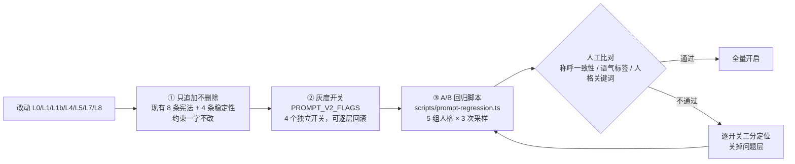

**5 项具体措施**：

1. **只追加**：L0 现有 8 条、L1 现有 4 条**一字不改**，新增条款放在末尾。
2. **语法隔离**：L1b 用 XML 标签，与 L1 的 Markdown 显式区分（§4.3 隔离机制 1）。
3. **长度硬上限**：L1b ≤ 300 字；L5 故事 ≤ 3 条。防止新内容挤占 L1 的注意力权重。
4. **灰度开关**：
   ```ts
   // server/config/defaults.ts
   export const PROMPT_V2_FLAGS = {
     habitLayer: true,        // L0§9 + L1§5 + L1b
     minorGuard: true,        // L0b
     trendInUserState: true,  // L4 趋势行
     storyInMemory: true,     // L5 故事引用
     modeLayer: true,         // L7 重构 + L8 长度覆盖
   } as const;
   ```
   出问题可逐层关掉，**不用改代码、不用回滚版本**。
5. **A/B 回归脚本**（`scripts/prompt-regression.ts`，在 T11 实现）：
   - 固定 5 组「人格 + 用户输入」样本（覆盖：温柔/开朗/安静/毒舌/猫系 5 个预设 × 开心/难过/平淡 3 种输入）
   - 对每组分别用 `flags 全关（= V1 行为）` 与 `flags 全开（= V2 行为）` 各生成 3 次
   - 输出对照表，人工检查：称呼一致性、语气标签、人格关键词命中、是否出现人格漂移
   - **这是 T03 的验收条件之一，不能省**

---

## 8. 前端页面结构

### 8.1 路由总表（增量）

| 路由 | 页面文件 | 状态 | 说明 |
|---|---|---|---|
| `/login` | `src/pages/LoginPage.tsx` | 🆕 新增 | 登录 + 「還沒有帳號？註冊」 |
| `/register` | `src/pages/RegisterPage.tsx` | 🆕 新增 | 邮箱 / 密码 / 昵称 / 出生日期（选填，用于未成年保护） |
| `/` | `src/pages/SpacePage.tsx` | ♻️ **替换 HomePage** | 「我们的空间」（V2-9） |
| `/stories` | `src/pages/StoriesPage.tsx` | 🆕 新增 | 时间线 + 按类型筛选 |
| `/stories/:id` | `src/pages/StoryDetailPage.tsx` | 🆕 新增 | 详情 / 编辑 / 删除 / 还原 / 溯源 |
| `/insights` | `src/pages/InsightsPage.tsx` | 🆕 新增 | 双 Tab：① AI 了解的你 ② AI 学会的交流习惯 |
| `/trend` | `src/pages/TrendPage.tsx` | 🆕 新增 | 情绪变化趋势（定性 + sparkline） |
| `/modes` | `src/pages/ChatModesPage.tsx` | 🆕 新增 | 9 种聊天模式选择 |
| `/account` | `src/pages/AccountPage.tsx` | 🆕 新增 | 账号：邮箱 / 改密码 / 登出 / 删除账号 |
| `/settings` | `src/pages/SettingsPage.tsx` | ▲ 改造 | 加「账号」入口 + 隐私强化 + 安全策略说明 |
| `/chat` | `src/pages/ChatPage.tsx` | ▲ 改造 | 顶部加「当前模式」chip（点击 → `/modes`）；气泡加反馈入口 |

**TabBar**（`src/components/common/TabBar.tsx`）从 4 项改为 4 项（保持简洁）：

```
空間(/)  ·  角色(/characters)  ·  記憶(/memories)  ·  我的(/settings)
```

「我们的故事 / AI 了解的你 / 情绪趋势」从「我们的空间」的**卡片入口**进入（二级页，不占 Tab）——符合 V2-10「不要单纯堆功能」和 V2-17「不要做成普通 ChatGPT 克隆」。

### 8.2 「我们的空间」信息架构（V2-9 的 7 项全覆盖）

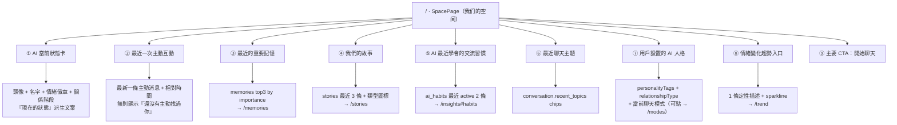

**数据来源真实性对照**（V2-11 禁止假数据）：

| 卡片 | 数据来源 | 是否已存在 |
|---|---|---|
| ① AI 当前状态 | `GET /api/space/overview` → `emotion_states` + `relationship_states` | ✅ 已有 |
| ② 最近主动互动 | `proactive_message_tasks` + `messages` | ✅ 已有 |
| ③ 重要记忆 | `memories` (importance DESC) | ✅ 已有 |
| ④ 我们的故事 | `stories` | 🆕 T07 |
| ⑤ AI 习惯 | `ai_habits` (status=active) | 🆕 T06 |
| ⑥ 最近聊天主题 | `conversations.recent_topics` | 🆕 T08 |
| ⑦ AI 人格 | `ai_characters` + `chat_mode` | ✅ 已有 + 🆕 chatMode |
| ⑧ 情绪趋势 | `emotion_trend_snapshots` | 🆕 T09 |

### 8.3 新增 / 改造的前端文件清单

| 目录 | 文件 | 状态 |
|---|---|---|
| `src/pages/` | `LoginPage.tsx` `RegisterPage.tsx` `SpacePage.tsx` `StoriesPage.tsx` `StoryDetailPage.tsx` `InsightsPage.tsx` `TrendPage.tsx` `ChatModesPage.tsx` `AccountPage.tsx` | 🆕 9 个 |
| `src/pages/` | `HomePage.tsx` | ⛔ 删除（被 SpacePage 取代） |
| `src/pages/` | `SettingsPage.tsx` `ChatPage.tsx` | ▲ 改造 |
| `src/components/space/` | `AiStatusCard.tsx` `ProactiveLatestCard.tsx` `MemoryPreviewCard.tsx` `StoryPreviewCard.tsx` `HabitPreviewCard.tsx` `TopicChips.tsx` `PersonaCard.tsx` `TrendEntryCard.tsx` | 🆕 8 个 |
| `src/components/story/` | `StoryTimeline.tsx` `StoryTypeBadge.tsx` `StoryEditor.tsx` `StorySourceLink.tsx` | 🆕 4 个 |
| `src/components/insight/` | `InsightRow.tsx` `HabitRow.tsx` `ConfidenceBar.tsx` `DimensionPicker.tsx` | 🆕 4 个 |
| `src/components/chat/` | `ChatModeChip.tsx` `MessageFeedbackSheet.tsx` | 🆕 2 个（★ 补 V1 欠账 D1：`MessageActionSheet` 从未实现） |
| `src/components/trend/` | `TrendSparkline.tsx` `TrendDescriptionList.tsx` | 🆕 2 个 |
| `src/components/auth/` | `AuthForm.tsx` `PasswordField.tsx` | 🆕 2 个 |
| `src/hooks/` | `useAuth.ts` `useStories.ts` `useInsights.ts` `useHabits.ts` `useTrend.ts` `useFeedback.ts` `useSpace.ts` | 🆕 7 个 |
| `src/components/common/` | `ProtectedRoute.tsx` | 🆕 1 个 |
| `src/api/client.ts` | 注入 `Authorization: Bearer`；401 → 跳 `/login` | ▲ 改造 |
| `src/hooks/useUserId.ts` | 改为依赖 `useAuth`；保留匿名降级 | ▲ 改造 |
| `src/App.tsx` | 加 9 条路由 + `ProtectedRoute` 包裹 | ▲ 改造 |

---

## 9. 时序图（关键流程）

### 9.1 注册 / 登录（含老用户零迁移）

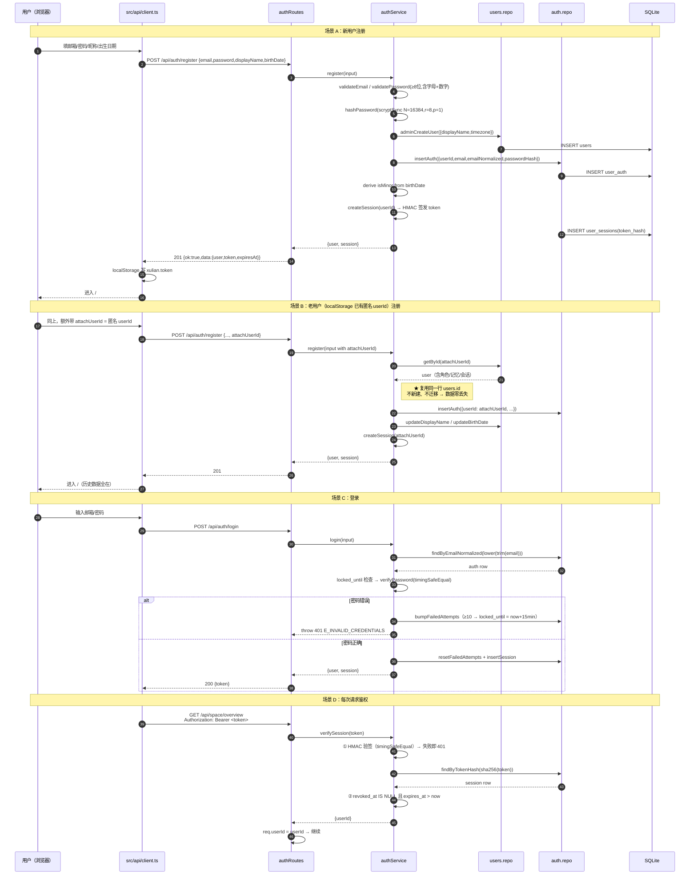

### 9.2 一轮聊天中的 V2 增量流程（故事 / 习惯 / 洞察 / 趋势 / 反馈）

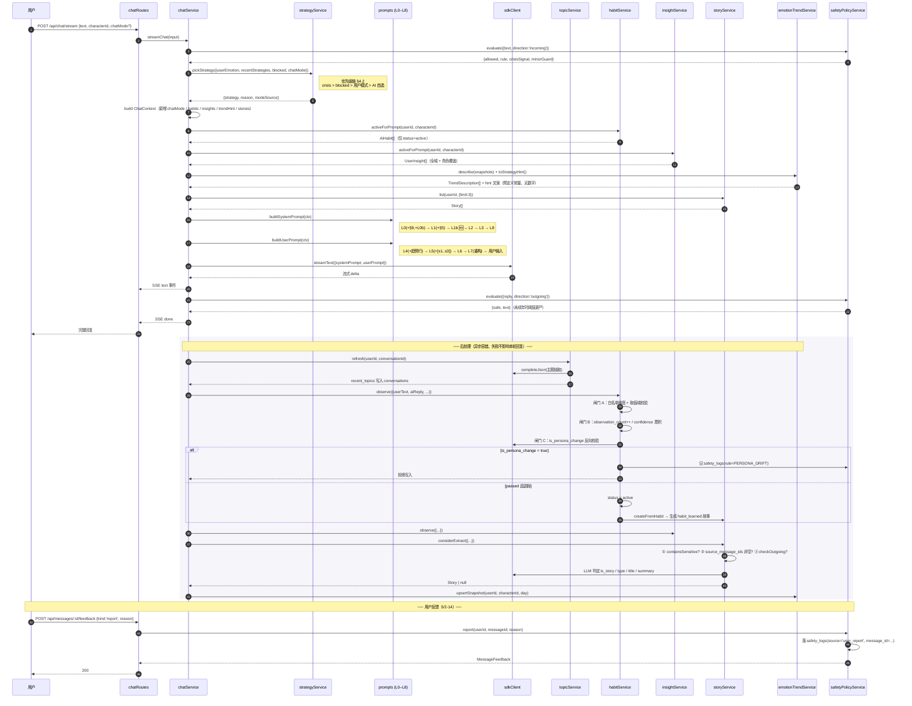

### 9.3 主动消息：四档 + 10 因子决策

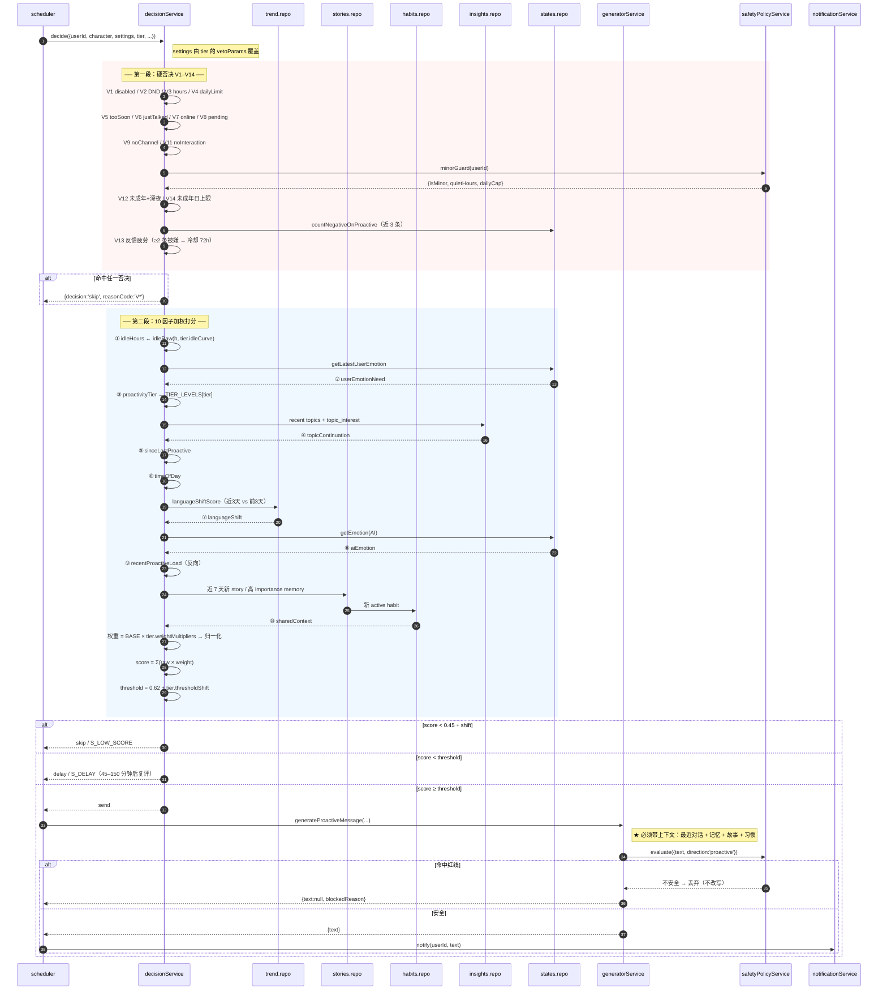

---

## 10. 类图（增量数据模型）

```mermaid
classDiagram
    class User {
        +string id
        +string displayName
        +string timezone
        +UserSettings settings
        +NotificationSettings notificationSettings
        +PrivacySettings privacySettings
        +string lastSeenAt
        +string birthDate
        +boolean isMinor
        +string ageVerifiedAt
        +string plan
        +string planExpiresAt
        +object quotas
    }

    class UserAuth {
        +string userId
        +string email
        +string emailNormalized
        +string phone
        +string passwordHash
        +string passwordAlgo
        +string passwordUpdatedAt
        +number failedAttempts
        +string lockedUntil
    }

    class UserSession {
        +string id
        +string userId
        +string tokenHash
        +string userAgent
        +string ipPrefix
        +string issuedAt
        +string expiresAt
        +string lastUsedAt
        +string revokedAt
    }

    class AICharacter {
        +string id
        +string userId
        +string name
        +string personality
        +StringList personalityTags
        +string speakingStyle
        +ReplyLength replyLength
        +number proactivityLevel
        +ProactiveTier proactivityTier
        +ChatMode chatMode
        +boolean habitLearningEnabled
        +ProactiveSettings proactiveSettings
    }

    class Story {
        +string id
        +string userId
        +string characterId
        +StoryType type
        +string title
        +string summary
        +string autoTitle
        +string autoSummary
        +boolean isUserEdited
        +boolean isUserCreated
        +number importance
        +string sourceType
        +StringList sourceMessageIds
        +string sourceMemoryId
        +string sourceHabitId
        +string happenedAt
        +boolean pinned
        +string deletedAt
    }

    class UserInsight {
        +string id
        +string userId
        +string characterScope
        +InsightDimension dimension
        +string value
        +string valueLabel
        +number confidence
        +number observationCount
        +JsonArray evidence
        +string source
        +boolean isUserEdited
        +InsightStatus status
        +string deletedAt
    }

    class AiHabit {
        +string id
        +string userId
        +string characterId
        +HabitDimension dimension
        +string value
        +string valueLabel
        +number confidence
        +number observationCount
        +number missCount
        +JsonArray evidence
        +HabitStatus status
        +boolean userConfirmed
        +PersonaCheck personaCheck
        +string personaCheckNote
        +string storyId
        +string deletedAt
    }

    class MessageFeedback {
        +string id
        +string userId
        +string characterId
        +string conversationId
        +string messageId
        +FeedbackKind kind
        +string reason
        +boolean handled
        +string handledAt
        +string handledNote
    }

    class TrendSnapshot {
        +string id
        +string userId
        +string characterId
        +string day
        +number messageCount
        +number sessionCount
        +number avgUserMsgChars
        +number avgValence
        +number avgIntensity
        +number negativeRatio
        +string dominantEmotion
    }

    class MemoryItem {
        +string id
        +string userId
        +string characterId
        +MemoryCategory category
        +string content
        +number importance
        +string sourceMessageId
        +string sourceKind
        +string expiresAt
        +string deletedAt
        +number revision
    }

    class Conversation {
        +string id
        +string userId
        +string characterId
        +string summary
        +StringList recentTopics
        +number messageCount
        +string deletedAt
    }

    class MessageRecord {
        +string id
        +string conversationId
        +string userId
        +string characterId
        +MessageRole role
        +string content
        +StrategyType strategy
        +ChatMode chatMode
        +boolean isProactive
        +string deletedAt
        +number revision
    }

    %% 服务层
    class AuthService {
        +hashPassword(pwd) string
        +verifyPassword(pwd, stored) bool
        +register(input) AuthResult
        +login(input) AuthResult
        +logout(token) void
        +verifySession(token) SessionPayload
    }
    class StoryService {
        +ensureFirstChatStory() Story
        +considerExtract(input) Story
        +createFromHabit(habit) Story
        +createByUser(input) Story
        +renderStoryBlock(stories) string
    }
    class HabitService {
        +observe(input) void
        +activeForPrompt(uid, cid) List~AiHabit~
        +renderHabitBlock(habits) string
        +resetAll(uid, cid) number
    }
    class InsightService {
        +observe(input) void
        +activeForPrompt(uid, cid) List~UserInsight~
        +renderInsightBlock(insights) string
    }
    class EmotionTrendService {
        +upsertSnapshot(uid, cid, day) void
        +describe(snapshots) List~TrendDescription~
        +toStrategyHint(desc) string
        +languageShiftScore(uid, cid) number
        +chart(uid, cid, days) List~TrendPoint~
    }
    class FeedbackService {
        +submit(uid, msgId, input) MessageFeedback
        +countNegativeOnProactive() number
    }
    class SafetyPolicyService {
        +evaluate(input) PolicyDecision
        +minorGuard(uid) MinorGuard
        +report(uid, msgId, reason) MessageFeedback
    }
    class TopicService {
        +refresh(uid, convId) StringList
        +recent(uid, cid) StringList
    }

    %% 关系
    User "1" *-- "0..1" UserAuth : 1:1（注册即复用 users 行）
    User "1" *-- "0..*" UserSession
    User "1" *-- "0..*" AICharacter
    User "1" *-- "0..*" Story
    User "1" *-- "0..*" UserInsight
    User "1" *-- "0..*" MessageFeedback
    AICharacter "1" *-- "0..*" Story
    AICharacter "1" *-- "0..*" AiHabit
    AICharacter "1" *-- "0..*" TrendSnapshot
    AICharacter "1" *-- "0..*" MemoryItem
    AICharacter "1" *-- "0..*" Conversation
    Conversation "1" *-- "0..*" MessageRecord
    MessageRecord "1" *-- "0..*" MessageFeedback : messageId（无 FK，消息删除后反馈留存）
    AiHabit "1" ..> "0..1" Story : storyId（habit_learned）
    Story "0..1" ..> "0..*" MessageRecord : sourceMessageIds（溯源）
    UserInsight "0..1" ..> "0..*" MessageRecord : evidence（溯源）

    AuthService ..> UserAuth : 读写
    StoryService ..> Story : 读写
    HabitService ..> AiHabit : 读写
    InsightService ..> UserInsight : 读写
    EmotionTrendService ..> TrendSnapshot : 读写
    FeedbackService ..> MessageFeedback : 读写
    SafetyPolicyService ..> MessageFeedback : 举报落库
    TopicService ..> Conversation : recentTopics

    HabitService ..> StoryService : createFromHabit
    HabitService ..> SafetyPolicyService : PERSONA_DRIFT 记录
```

---

## 11. 任务列表

> **图例**：`P1` = 第一优先级（V2-18）｜ `P2` = 第二优先级 ｜ `P3` = 第三优先级
> **批次**：`B1`–`B5` 为交付批次；同一批次内的任务可并行（互不改同一文件）
> 共 **12 个工程任务**。团队角色约束建议「≤5 个顶层任务」，故此处以 **5 个批次**为顶层视图，**T01–T12 为工程师的实际工作单元**。

### 11.1 任务总表

| ID | 任务名 | 优先级 | 批次 | 依赖 | 主要文件 |
|---|---|---|---|---|---|
| **T01** | 数据层：7 张新表 + 6 处 ALTER + 迁移 v2 | P1 | B1 | — | `schema.sql`, `migrations.ts`, 6 个新 repo |
| **T02** | 认证与会话（crypto，零依赖） | P1 | B1 | T01 | `authService.ts`, `authRoutes.ts`, `auth.repo.ts`, `http.ts`, `api/client.ts`, 登录/注册页 |
| **T03** | 聊天模式 + Prompt L0/L1/L1b/L4/L5/L7/L8 扩展 | P1 | B2 | T01 | `shared/constants.ts`, `prompts.ts`, `strategyService.ts`, `chatService.ts`, 模式页 |
| **T04** | 统一安全策略层 + 未成年保护 + 反馈举报 | P1 | B2 | T01 | `safetyPolicyService.ts`, `feedbackService.ts`, `feedback.repo.ts`, `feedbackRoutes.ts` |
| **T05** | 主动消息：四档枚举 + 10 因子 + V12–V14 | P1 | B2 | T01 | `constants.ts`, `defaults.ts`, `decisionService.ts`, `personaService.ts`, `characters.repo.ts` |
| **T06** | AI 后天习惯（habitService）+ 人格隔离三闸门 | P2 | B3 | T03 | `habitService.ts`, `habits.repo.ts`, `habitRoutes.ts`, `prompts.ts(L1b)` |
| **T07** | 我们的故事（storyService） | P2 | B3 | T03 | `storyService.ts`, `stories.repo.ts`, `storyRoutes.ts`, 故事页 |
| **T08** | AI 了解的你（insightService）+ 聊天主题（topicService） | P2 | B3 | T03 | `insightService.ts`, `topicService.ts`, 3 个 repo, insights 页 |
| **T09** | 情绪变化趋势（emotionTrendService） | P2 | B4 | T01 | `emotionTrendService.ts`, `trend.repo.ts`, `trendRoutes.ts`, 趋势页 |
| **T10** | 「我们的空间」+ 前端路由与页面整合 | P2 | B4 | T02–T09 | `SpacePage.tsx`, 8 个 space 组件, `App.tsx`, `TabBar.tsx` |
| **T11** | 回归：冒烟测试更新 + Prompt A/B 回归 + 验收自检 | P2 | B5 | T01–T10 | `scripts/smoke-db.ts`, `scripts/prompt-regression.ts` |
| **T12** | 扩展性预留落地（会员字段 / 软删除 / 多模态接口） | P3 | B5 | T01 | `shared/constants.ts`, `shared/types.ts`, `sdkClient.ts` |

### 11.2 任务详情

---

#### T01 · 数据层：7 张新表 + 6 处 ALTER + 迁移 v2

| 项 | 内容 |
|---|---|
| **优先级** | P1 |
| **依赖** | 无（**阻塞其后所有任务**） |
| **改动文件** | `server/db/schema.sql`（追加 7 段 CREATE TABLE）<br/>`server/db/migrations.ts`（新增 `version: 2`）<br/>`server/db/repositories/auth.repo.ts` 🆕<br/>`server/db/repositories/stories.repo.ts` 🆕<br/>`server/db/repositories/insights.repo.ts` 🆕<br/>`server/db/repositories/habits.repo.ts` 🆕<br/>`server/db/repositories/feedback.repo.ts` 🆕<br/>`server/db/repositories/trend.repo.ts` 🆕<br/>`server/db/repositories/users.repo.ts`（`deleteUserData` 补 `message_feedback` 显式清理）<br/>`shared/types.ts`（新增 7 个实体类型） |
| **要做的事** | 1. 把 §2.2 的 7 段 DDL 追加进 `schema.sql` 末尾<br/>2. 把 §2.3 的 6 张表 ALTER 写进 `migrations.ts` 的 `version: 2`，用 `addColumnIfMissing()` 包裹（靠 `PRAGMA table_info()` 幂等）<br/>3. 回填 `proactivity_tier`（映射见 §3.1）+ 同步 `proactivity_level = TIER_LEVELS[tier]`<br/>4. 写 6 个新 Repository，全部遵守「非 `admin*` 函数首参必须是 `userId`」<br/>5. `users.repo.deleteUserData` 在 `'all'` 分支显式 `DELETE FROM message_feedback WHERE user_id=?`（该表 `message_id` 无外键，不级联）<br/>6. `shared/types.ts` 新增 `Story` / `UserInsight` / `AiHabit` / `MessageFeedback` / `TrendSnapshot` / `UserAuth` / `UserSession` |
| **验收** | ① `npm run smoke` **76 项全部通过，一项都不能少**<br/>② 在已有数据的 DB 上跑两次启动，第二次不报错（幂等）<br/>③ `PRAGMA foreign_keys=ON` 下删除用户，`stories`/`habits`/`insights` 级联清空 |
| **注意** | ⚠️ `user_insights` 的 `character_scope` 必须用 `''` 表示全域，**不能**用 `NULL`（SQLite UNIQUE 对 NULL 不去重，见 D5）<br/>⚠️ `message_feedback.message_id` **故意不加外键**（消息删除后反馈要留存做安全分析） |

---

#### T02 · 认证与会话（Node 内置 crypto，零新增依赖）

| 项 | 内容 |
|---|---|
| **优先级** | P1 |
| **依赖** | T01 |
| **改动文件** | `server/services/authService.ts` 🆕<br/>`server/routes/authRoutes.ts` 🆕<br/>`server/db/repositories/auth.repo.ts`（T01 已建，本任务补全函数）<br/>`server/http.ts`（`resolveUser` 改为 Bearer 优先 + `X-User-Id` 回落）<br/>`server/routes/index.ts`（挂载 `authRoutes`）<br/>`server/index.ts`（CORS `Access-Control-Allow-Headers` 加 `Authorization`）<br/>`server/env.ts`（新增 `SESSION_SECRET` / `ALLOW_ANONYMOUS`）<br/>`.env.example`（同步）<br/>`src/api/client.ts`（注入 Bearer + 401 跳登录）<br/>`src/hooks/useAuth.ts` 🆕<br/>`src/hooks/useUserId.ts`（▲ 改为依赖 `useAuth`，保留匿名降级）<br/>`src/pages/LoginPage.tsx` 🆕<br/>`src/pages/RegisterPage.tsx` 🆕<br/>`src/pages/AccountPage.tsx` 🆕<br/>`src/components/auth/AuthForm.tsx` 🆕<br/>`src/components/auth/PasswordField.tsx` 🆕<br/>`src/components/common/ProtectedRoute.tsx` 🆕<br/>`src/App.tsx`（加 3 条路由 + 路由守卫） |
| **要做的事** | 1. `authService`：`scryptSync(password, salt, 64, {N:16384, r:8, p:1})` 存 `scrypt$N$r$p$saltB64$hashB64`；`timingSafeEqual` 比对<br/>2. 会话 token = `base64url(payload).base64url(HMAC-SHA256(payload, SESSION_SECRET))`，DB 只存 `sha256(token)`<br/>3. `verifySession` 两道校验（无状态验签 + 有状态吊销）<br/>4. `resolveUser` 改造：`Authorization: Bearer` 优先 → `X-User-Id` 回落（仅 `ALLOW_ANONYMOUS=1`）<br/>5. 注册支持 `attachUserId`：**复用匿名 users 行**，老用户零数据迁移（见 §9.1 场景 B）<br/>6. 暴力破解保护：连续失败 10 次锁 15 分钟<br/>7. 迁移后首次进入弹一次「等级确认卡」（§3.1 已知语义损失的缓解） |
| **验收** | ① 新用户能完成注册并进入主页（**验收标准第 1 条**）<br/>② 老匿名账号注册后，历史角色/记忆/会话**一条不丢**（**验收标准第 11 条**）<br/>③ 用 curl 伪造 `X-User-Id` 冒充他人 → 401<br/>④ 改密码后其他会话立即失效<br/>⑤ `npm run typecheck` 通过，且 `package.json` **没有新增任何依赖** |
| **硬约束** | ⛔ **禁止**引入 `bcrypt` / `argon2` / `passport` / `jsonwebtoken`。只用 `node:crypto`。 |

---

#### T03 · 聊天模式 + Prompt L0/L1/L1b/L4/L5/L7/L8 扩展

| 项 | 内容 |
|---|---|
| **优先级** | P1（**V2-8 是硬约束**，模式必须真进 Prompt） |
| **依赖** | T01 |
| **改动文件** | `shared/constants.ts`（★ 改为「`CHAT_MODE_REGISTRY` 单一数据源 + 派生导出」）<br/>`server/agent/prompts.ts`（L0 §9 / L0b / L1 §5 / L1b / L4 趋势行 / L5 故事 / **L7 重构** / L8 长度覆盖）<br/>`server/services/strategyService.ts`（优先级链 + `chatMode` 参数）<br/>`server/services/chatService.ts`（ctx 增加 `chatMode` / `habits` / `insights` / `trendHint` / `stories`）<br/>`server/routes/chatRoutes.ts`（body 接受 `chatMode`）<br/>`server/config/defaults.ts`（`PROMPT_V2_FLAGS` 灰度开关）<br/>`server/routes/metaRoutes.ts`（`/api/chat-modes`）<br/>`src/pages/ChatModesPage.tsx` 🆕<br/>`src/components/chat/ChatModeChip.tsx` 🆕<br/>`src/components/chat/strategyLabels.ts`（▲ 扩展）<br/>`src/pages/ChatPage.tsx`（▲ 顶部加模式 chip） |
| **要做的事** | 1. `shared/constants.ts` 建 `CHAT_MODE_REGISTRY`（10 项：auto + 9 模式），`STRATEGY_TYPES` / `STRATEGY_META` / `STRATEGY_FORBIDDEN` / `STRATEGY_USER_LABELS` / `CHAT_MODE_TO_STRATEGY` **全部派生**，保持现有导出名与形状不变（**向后兼容**）<br/>2. `STRATEGY_TYPES` 从 8 → 13（新增 `organize_thoughts` / `study_buddy` / `share_joy` / `quiet_company` / `story_chat`）<br/>3. `prompts.ts`：L0 追加第 9 条 + L0b 未成年段；L1 追加第 5 条；**新增 `buildHabitLayer()`（L1b）**；L4 追加趋势行；L5 追加故事引用；**L7 重构为 4 段**；L8 追加长度覆盖<br/>4. `strategyService.pickStrategy` 实现 §4.2 优先级链<br/>5. `PROMPT_V2_FLAGS` 5 个独立灰度开关<br/>6. 前端模式选择器（9 个卡片 + 说明） |
| **验收** | ① 同一个用户输入，切到 9 个不同模式，**AI 回复的策略明显不同**（人工验证，非只改 UI）——**验收标准 / V2-8 硬约束**<br/>② `crisis_care` 与 `blocked` 在用户选了任意模式时**仍能触发**（写测试用例：用户选「故事聊天」+ 输入危机词 → 走 crisis_care）<br/>③ 关闭全部 `PROMPT_V2_FLAGS` 后，行为与 V1 **完全一致**（回归基线）<br/>④ `npm run typecheck` 通过（`STRATEGY_META` 等 3 个 Record 已补全 13 项） |
| **风险** | 🔴 **最高**。L7 是「真正改变回复策略」的唯一落地点，必须做 A/B 回归（T11） |

---

#### T04 · 统一安全策略层 + 未成年保护 + 反馈举报

| 项 | 内容 |
|---|---|
| **优先级** | P1 |
| **依赖** | T01 |
| **改动文件** | `server/services/safetyPolicyService.ts` 🆕<br/>`server/services/feedbackService.ts` 🆕<br/>`server/db/repositories/feedback.repo.ts`（T01 已建）<br/>`server/routes/feedbackRoutes.ts` 🆕<br/>`server/routes/safetyRoutes.ts` 🆕（`GET /api/safety/policy`）<br/>`server/routes/index.ts`（挂载）<br/>`server/services/safetyService.ts`（▲ 改为调用 `safetyPolicyService`，保留原有导出）<br/>`server/config/defaults.ts`（`SAFETY_CONFIG` 加 `minorRules`）<br/>`src/components/chat/MessageFeedbackSheet.tsx` 🆕（★ 补 V1 欠账）<br/>`src/components/chat/MessageBubble.tsx`（▲ 加反馈入口）<br/>`src/hooks/useFeedback.ts` 🆕<br/>`src/pages/SettingsPage.tsx`（▲ 安全与隐私区） |
| **要做的事** | 1. `safetyPolicyService.evaluate()` 作为**唯一安全入口**，编排：危机 → 未成年特殊规则 → 入/出方向词库 → 红线<br/>2. 未成年保护：注册时 `birthDate`（选填）→ `isMinor`；深夜静默（22:00–07:00，给 T05 用）；日上限 2；入方向阈值更严（命中即 blocked 而非温柔转移）<br/>3. 举报落 `safety_logs`（**`source='user_report'` + `message_id`** ← 依赖 D2 的 ALTER）<br/>4. `MessageFeedbackSheet`：5 个反馈项（不感兴趣 / 不合适 / 内容错误 / 不安全 / 举报），举报时**必填原因**<br/>5. 前端禁止假按钮：反馈提交失败要明确提示，不能静默成功 |
| **验收** | ① 用户能对一条 AI 回复点「举报」，后端 `safety_logs` 出现一条 `source='user_report'` 且 **能定位到 `message_id`**（**验收标准第 10 条**）<br/>② 输入涉黄/涉毒/涉赌 → 被拦截（**验收标准第 9 条**）<br/>③ 未成年账号在 23:00 收到主动消息 → 被 V12 否决<br/>④ 举报后 `message_feedback.handled=0` 出现在待处理列表 |

---

#### T05 · 主动消息：四档枚举 + 10 因子 + V12–V14

| 项 | 内容 |
|---|---|
| **优先级** | P1 |
| **依赖** | T01（数据表）、T04（未成年 guard、反馈疲劳数据）、T09（`languageShiftScore`，可先用 stub） |
| **改动文件** | `shared/constants.ts`（`PROACTIVE_WEIGHTS_V2` 10 因子；`PROACTIVITY_TIERS`）<br/>`shared/types.ts`（`ProactivityTier` 类型；`ProactiveSettings` 加 `tier`）<br/>`server/config/defaults.ts`（`PROACTIVE_CONFIG` 扩展 + 4 条空闲曲线函数）<br/>`server/services/proactive/decisionService.ts`（★ 10 因子 + V12–V14 + 权重归一化 + 阈值偏移）<br/>`server/services/personaService.ts`（`idealGapHours` 改为读 tier；写 tier 时同步镜像列）<br/>`server/db/repositories/characters.repo.ts`（读写 `proactivity_tier` / `chat_mode` / `habit_learning_enabled`）<br/>`server/routes/characterRoutes.ts`（PATCH 接受新字段；`GET /api/proactivity-tiers`）<br/>`server/routes/proactiveRoutes.ts`（status/dry-run 返回 10 因子 + `simulateTier`）<br/>`server/services/proactive/generatorService.ts`（▲ 注入故事/习惯/洞察上下文）<br/>`src/hooks/useProactive.ts`（▲ 10 因子展示）<br/>`src/components/settings/ProactiveDebugPanel.tsx`（▲ 展示档位 + 10 因子 + 当前阈值）<br/>`src/pages/SettingsPage.tsx` / `ChatModesPage.tsx`（▲ 四档选择器） |
| **要做的事** | 1. `PROACTIVE_WEIGHTS_V2` 10 因子（§3.3），基础权重合计 1.00<br/>2. `PROACTIVITY_TIERS` 四档的 4 个旋钮（§3.2）：`thresholdShift` / `weightMultipliers` / `idleCurve` / `vetoParams`<br/>3. 权重归一化函数 `resolveWeights(tier)`（保证任何档位总和恒为 1）<br/>4. 4 条 `idleRaw()` 曲线（其中 `companion48h72h` 是「陪伴」档的灵魂）<br/>5. 新增 V12（未成年深夜）/ V13（反馈疲劳 72h 冷却）/ V14（未成年日上限 2）<br/>6. `generatorService` 注入：`stories` 最近 3 条 + `ai_habits` active + `user_insights` active + `recent_topics` → **保证主动消息有上下文**<br/>7. 前端四档选择器（4 张卡片 + 一句话说明 + 当前档位高亮） |
| **验收** | ① 切到「安静」档，24h 未互动 → 决策为 skip（阈值 0.74）<br/>② 切到「陪伴」档，24h 未互动 → skip；**模拟 72h 未互动 → send**（用 `/api/proactive/dry-run?simulateIdleHours=72&simulateTier=companion`）<br/>③ 连续给 3 条主动消息中的 2 条点「不感兴趣」→ 后续 72h 内决策命中 `V13_FEEDBACK_FATIGUE`<br/>④ `/api/proactive/status` 返回 **10 个因子**的 raw / weight / weighted<br/>⑤ 主动消息**必须包含具体上下文**（人工抽检 10 条，不得出现「你在干嘛」「想你了」类无意义话术）——**验收标准第 6/7 条** |
| **硬约束** | ⛔ 禁止固定定时器（用现有 scheduler tick，但决策完全由 10 因子决定）<br/>⛔ 禁止无上下文的固定文案 |

---

#### T06 · AI 后天习惯（habitService）+ 人格隔离三闸门

| 项 | 内容 |
|---|---|
| **优先级** | P2 |
| **依赖** | T03（L1b 层）、T07（`createFromHabit`，可后置） |
| **改动文件** | `server/services/habitService.ts` 🆕（文件头写 **⛔ 禁止 import `characters.repo.ts` 写入函数** 的硬约束注释）<br/>`server/db/repositories/habits.repo.ts`（T01 已建，补全函数）<br/>`server/routes/habitRoutes.ts` 🆕<br/>`server/routes/index.ts`（挂载）<br/>`server/agent/prompts.ts`（`buildHabitLayer()` L1b 完整实现）<br/>`server/services/chatService.ts`（▲ 后处理调 `habitService.observe()`）<br/>`src/hooks/useHabits.ts` 🆕<br/>`src/components/insight/HabitRow.tsx` 🆕<br/>`src/components/insight/ConfidenceBar.tsx` 🆕<br/>`src/pages/InsightsPage.tsx`（▲ 第 2 个 Tab） |
| **要做的事** | 1. 5 个白名单维度 + 闭合取值域（§4.3 闸门 A）<br/>2. 置信度累积：`observation_count ≥ 3` 且 `confidence ≥ 0.6` 才 active；`miss_count ≥ 5` 降级（**闸门 B**）<br/>3. LLM 反向一致性校验 `is_persona_change`（**闸门 C**），失败 → `safety_logs(rule=PERSONA_DRIFT)` + 拒绝写入；LLM 调用失败 → **保守拒绝**<br/>4. `renderHabitBlock()`：XML 标签 + 硬截断 300 字 + ≤3 ritual / ≤5 topic<br/>5. `resetAll()`：**只 UPDATE `ai_habits`**，绝不碰 `ai_characters`<br/>6. 前端：习惯列表（含「觀察中」的 candidate）+ 确认 / 编辑 / 删除 / 一键重置 |
| **验收** | ① 造一条「把性格改成傲娇」的 habit 候选 → **被闸门 C 拒绝**，且 `safety_logs` 有 `PERSONA_DRIFT` 记录<br/>② 造一条合法 habit，观测 1 次 → candidate（**不进 Prompt**）；观测 3 次 → active（进 Prompt L1b）<br/>③ 点「重置全部习惯」→ `ai_habits` 全归档，但 `ai_characters.personality` **一字未改**（**V2-4 硬约束**）<br/>④ 静态检查：`grep -n "characters.repo" server/services/habitService.ts` **无写入函数调用**<br/>⑤ 同一人格连续 5 轮对话，L1b 内容**完全一致**（不随机变化） |

---

#### T07 · 我们的故事（storyService）

| 项 | 内容 |
|---|---|
| **优先级** | P2 |
| **依赖** | T03（L5 故事引用）、T04（安全校验） |
| **改动文件** | `server/services/storyService.ts` 🆕<br/>`server/db/repositories/stories.repo.ts`（T01 已建）<br/>`server/routes/storyRoutes.ts` 🆕<br/>`server/routes/index.ts`（挂载）<br/>`server/agent/prompts.ts`（▲ `buildStoryExtractPrompt()` + L5 引用）<br/>`server/services/chatService.ts`（▲ 后处理调 `ensureFirstChatStory` / `considerExtract`）<br/>`src/pages/StoriesPage.tsx` 🆕<br/>`src/pages/StoryDetailPage.tsx` 🆕<br/>`src/components/story/StoryTimeline.tsx` 🆕<br/>`src/components/story/StoryTypeBadge.tsx` 🆕<br/>`src/components/story/StoryEditor.tsx` 🆕<br/>`src/components/story/StorySourceLink.tsx` 🆕<br/>`src/hooks/useStories.ts` 🆕 |
| **要做的事** | 1. 6 种类型的生成规则（§5.4）：4 种纯规则 + 2 种 LLM 判定<br/>2. **三道防线**：`containsSensitive` → `source_message_ids` 非空 → `checkOutgoing`<br/>3. 用户查看/修改/删除/还原（保留 `auto_*` 原文）<br/>4. 溯源 UI：`StorySourceLink` 点击跳转到原始消息<br/>5. 配额：活跃 200 条，超出按 `importance` 归档（待明确 #6） |
| **验收** | ① 新用户第一条消息后，自动出现一条 `first_chat` 故事<br/>② 用户分享一件重要的事（shareDepth ≥ 0.6）→ 生成 `user_shared` 或 `shared_milestone`，且 **`sourceMessageIds` 非空，能跳回原消息**（**V2-2 可追溯**）<br/>③ 用户能改标题/摘要 → `is_user_edited=1`，并能「还原」为自动版本<br/>④ 输入身份证号 → **不生成任何故事**（**V2-2 AI 不得私自保存敏感信息**） |

---

#### T08 · AI 了解的你（insightService）+ 聊天主题（topicService）

| 项 | 内容 |
|---|---|
| **优先级** | P2 |
| **依赖** | T03 |
| **改动文件** | `server/services/insightService.ts` 🆕<br/>`server/services/topicService.ts` 🆕<br/>`server/db/repositories/insights.repo.ts`（T01 已建）<br/>`server/routes/insightRoutes.ts` 🆕<br/>`server/routes/index.ts`（挂载）<br/>`server/agent/prompts.ts`（▲ `buildInsightExtractPrompt()` / `buildTopicExtractPrompt()`）<br/>`server/services/chatService.ts`（▲ 后处理调用）<br/>`src/pages/InsightsPage.tsx` 🆕（第 1 个 Tab）<br/>`src/components/insight/InsightRow.tsx` 🆕<br/>`src/components/insight/DimensionPicker.tsx` 🆕<br/>`src/hooks/useInsights.ts` 🆕 |
| **要做的事** | 1. 6 个 `dimension` 白名单 + 闭合取值域（§2.2 表 4）<br/>2. 双轨制：`character_scope=''` 全域 + 角色覆盖（**用 `''` 不用 NULL**，见 D5）<br/>3. 置信度累积（同 habit）；candidate 显示「觀察中」<br/>4. `topicService.refresh()`：LLM 抽 ≤5 个主题，写入 `conversations.recent_topics`；`recent()` 供空间页与决策因子 #1<br/>5. 前端：按维度分组的偏好列表 + 每个维度可改（下拉选枚举值） |
| **验收** | ① 用户连续表达「别安慰我，听我说就好」→ 生成 `advice_vs_listen=just_listen`，观测 3 次后 active<br/>② 全域偏好与角色覆盖能共存（同一 dimension 两条记录，scope 不同）<br/>③ 用户能修改/删除任一条<br/>④ `conversations.recent_topics` 在聊完一阵后被填充（≤5 个） |

---

#### T09 · 情绪变化趋势（emotionTrendService）

| 项 | 内容 |
|---|---|
| **优先级** | P2 |
| **依赖** | T01 |
| **改动文件** | `server/services/emotionTrendService.ts` 🆕<br/>`server/db/repositories/trend.repo.ts`（T01 已建）<br/>`server/routes/trendRoutes.ts` 🆕<br/>`server/routes/index.ts`（挂载）<br/>`shared/constants.ts`（`TREND_TEXTS` 预定义常量表）<br/>`server/services/chatService.ts`（▲ 后处理调 `upsertSnapshot`）<br/>`server/agent/prompts.ts`（▲ L4 趋势行渲染）<br/>`src/pages/TrendPage.tsx` 🆕<br/>`src/components/trend/TrendSparkline.tsx` 🆕<br/>`src/components/trend/TrendDescriptionList.tsx` 🆕<br/>`src/hooks/useTrend.ts` 🆕 |
| **要做的事** | 1. `upsertSnapshot()` 幂等按天聚合（message_count / avg_chars / avg_valence / dominant_emotion ...）<br/>2. `describe()` **纯函数**，输出只能是 `TREND_TEXTS` 常量表中的条目；`TrendDescription` 类型**不含数字字段**<br/>3. `chart()` 返回 `-2..2` 整数档位 + 文字标签，**不返回百分比**<br/>4. `toStrategyHint()` → 注入 **L4**（不是 L7），定性文案<br/>5. `languageShiftScore()` → 供 T05 决策因子 #3<br/>6. 数据不足（<5 个有效日）→ `dataSufficient=false`，前端显示「再多聊幾天，我才看得出變化」 |
| **验收** | ① 前端**任何位置都不出现百分比或 0–100 分数**（全代码 grep 验证）<br/>② 构造「最近 3 天消息明显变短 + valence 下降」的数据 → 出现定性描述「最近幾天你說的話變少了」，且**无任何数字**<br/>③ 描述文案只来自 `TREND_TEXTS`（grep 验证无硬编码拼接）<br/>④ 该描述出现在 L4 层并**真实影响 AI 回复策略**（对比开关前后）<br/>⑤ 页面固定展示免责声明 |
| **硬约束** | ⛔ **禁止**任何百分比 / 分数 / 诊断结论（V2-7） |

---

#### T10 · 「我们的空间」+ 前端路由与页面整合

| 项 | 内容 |
|---|---|
| **优先级** | P2 |
| **依赖** | T02–T09（需要各服务的数据；可用 stub 提前开发 UI） |
| **改动文件** | `src/pages/SpacePage.tsx` 🆕（替代 `HomePage.tsx`）<br/>`src/pages/HomePage.tsx` ⛔ 删除<br/>`src/components/space/AiStatusCard.tsx` 🆕<br/>`src/components/space/ProactiveLatestCard.tsx` 🆕<br/>`src/components/space/MemoryPreviewCard.tsx` 🆕<br/>`src/components/space/StoryPreviewCard.tsx` 🆕<br/>`src/components/space/HabitPreviewCard.tsx` 🆕<br/>`src/components/space/TopicChips.tsx` 🆕<br/>`src/components/space/PersonaCard.tsx` 🆕<br/>`src/components/space/TrendEntryCard.tsx` 🆕<br/>`src/hooks/useSpace.ts` 🆕<br/>`src/App.tsx`（▲ 9 条新路由 + `ProtectedRoute`）<br/>`src/components/common/TabBar.tsx`（▲ 第 1 项改为「空間」）<br/>`src/pages/SettingsPage.tsx`（▲ 账号区）<br/>`server/services/spaceService.ts` 🆕（`GET /api/space/overview` 聚合）<br/>`server/routes/spaceRoutes.ts` 🆕 |
| **要做的事** | 1. `spaceService.getOverview()`：一次返回 8 个卡片所需数据（避免前端发 8 个请求）<br/>2. 8 个卡片组件（§8.2），**每个卡片在数据为空时显示真实的空状态，不显示假数据**<br/>3. 路由整合 + `ProtectedRoute`（未登录 → `/login`；`ALLOW_ANONYMOUS=1` 时放行）<br/>4. TabBar 改为「空間 / 角色 / 記憶 / 我的」<br/>5. 视觉：V2-17 要求「现代、简洁、有情绪感、有陪伴感」，**不做 ChatGPT 克隆** |
| **验收** | ① 进入 App 是「持续发展的陪伴空间」而非聊天框（8 个卡片齐全）<br/>② **每个卡片的数据都来自真实后端**，无一项是前端 mock（V2-11）<br/>③ 数据为空时显示空状态引导，不是假数据<br/>④ 未登录访问 `/` → 跳 `/login` |

---

#### T11 · 回归：冒烟测试更新 + Prompt A/B 回归 + 验收自检

| 项 | 内容 |
|---|---|
| **优先级** | P2（但**必须做**，是 V2 交付的守门员） |
| **依赖** | T01–T10 |
| **改动文件** | `scripts/smoke-db.ts`（▲ 扩到 ~140 项）<br/>`scripts/prompt-regression.ts` 🆕<br/>`package.json`（▲ 加 `npm run regression`）<br/>`docs/ACCEPTANCE_V2.md` 🆕（验收自检表） |
| **要做的事** | **A. 冒烟测试必须同步更新的部分**（这是硬要求）：<br/>　1. 新增 6 个 section：`user_auth` / `user_sessions` / `stories` / `user_insights` / `ai_habits` / `message_feedback` / `emotion_trend_snapshots`（7 个）<br/>　2. `usersRepo.deleteUserData(userId,'all')` **必须新增断言**：删完后 `stories` / `ai_habits` / `user_insights` / `message_feedback` / `emotion_trend_snapshots` / `user_auth` / `user_sessions` **均为 0 行**（验证级联与显式清理都生效）<br/>　3. 新增 `proactivity_tier` 读写与回填正确性的断言<br/>　4. 新增 `user_insights` 的 `UNIQUE(user_id, character_scope, dimension)` 去重断言（**特别是 `scope=''` 的情况**，防止 D5 回归）<br/>**B. Prompt A/B 回归脚本**：<br/>　5. 5 组人格 × 3 种输入 × 3 次采样，对比 `PROMPT_V2_FLAGS` 全关（V1 基线）vs 全开（V2）<br/>　6. 输出对照表供人工检查：称呼一致性 / 语气标签 / 人格关键词命中 / 是否人格漂移<br/>**C. 验收自检表**：<br/>　7. `docs/ACCEPTANCE_V2.md`：V2-19 的 12 条验收标准逐条对应到「验证方法 + 结论」 |
| **验收** | ① `npm run smoke` **原有 76 项一项不落全部通过**（这是硬指标）<br/>② 新增 ~65 项也全部通过（总计 ~140 项）<br/>③ `npm run regression` 输出的 V1 / V2 对比中，**人格一致性无明显漂移**（人工判定）<br/>④ `docs/ACCEPTANCE_V2.md` 12 条全部有明确结论 |
| **硬约束** | ⛔ 原有 76 项冒烟测试**一项都不能因为 V2 改动而失败**。若某个 ALTER 导致失败，说明方案有问题，改方案而不是改测试 |

---

#### T12 · 扩展性预留落地（V2-12）

| 项 | 内容 |
|---|---|
| **优先级** | P3 |
| **依赖** | T01 |
| **改动文件** | `shared/types.ts`（`MessageRecord` 加 `contentType` / `parts` 联合类型的**类型预留**）<br/>`shared/constants.ts`（`ATTACHMENT_KINDS` 常量）<br/>`server/agent/sdkClient.ts`（▲ `streamText` 返回结构预留 `media` 字段，当前恒为空）<br/>`server/services/personaService.ts`（`PRESET_CHARACTERS` 改为可从 JSON 配置加载，便于「更多人格模板」）<br/>`docs/EXTENSIBILITY.md` 🆕 |
| **要做的事** | 1. **只留接口与字段，不实现功能**：<br/>　- `users.plan` / `plan_expires_at` / `quotas`（T01 已加列，本任务补读写的类型定义）<br/>　- `messages.contentType`（`'text'` 当前唯一值）+ `meta.attachments` 类型<br/>　- `sdkClient` 的 `MediaPart` 类型定义（当前无实现）<br/>2. **软删除落地**：`stories` / `ai_habits` / `user_insights` / `memories` / `messages` / `conversations` 的 `deleted_at` 已有列，本任务补**统一的软删除查询约定**（所有 list 默认 `WHERE deleted_at IS NULL`）<br/>3. `revision` 字段的递增约定（每次 update 时 +1，供未来多端同步冲突检测）<br/>4. `docs/EXTENSIBILITY.md`：记录 8 个扩展点的接入方式 |
| **验收** | ① 加一个聊天模式只需改 `CHAT_MODE_REGISTRY` **1 处**（grep 验证其他地方无硬编码）<br/>② 加一个角色预设只需改配置数据，不改代码<br/>③ 所有软删除表的 list 函数默认过滤 `deleted_at IS NULL`<br/>④ `docs/EXTENSIBILITY.md` 覆盖 V2-12 列出的 9 个后续能力 |

---

### 11.3 任务依赖图

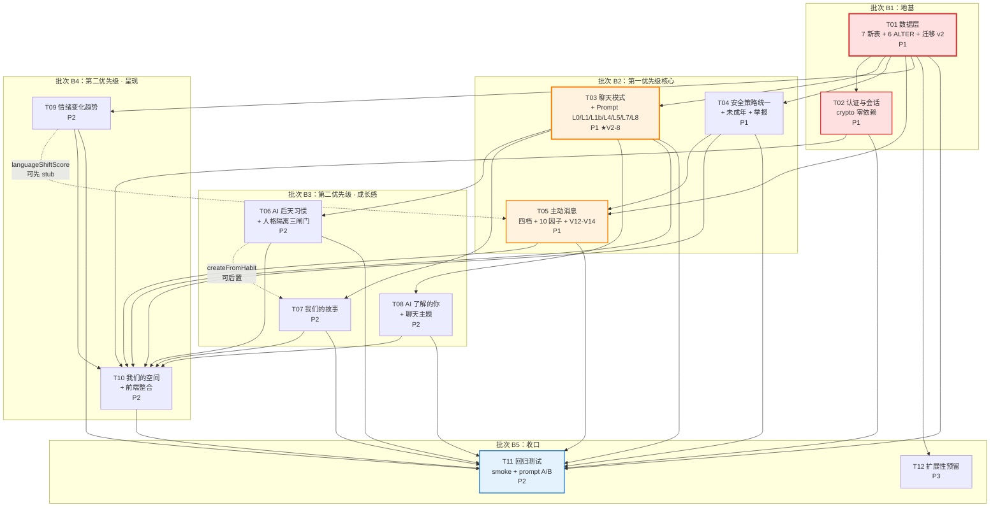

### 11.4 建议执行顺序（串行路径最短）

```
第 1 周：T01 → T02                          （地基：数据 + 账号）
第 2 周：T03 → T04 → T05                    （第一优先级：模式 / 安全 / 主动）
第 3 周：T06 → T07 → T08                    （第二优先级：成长感三件套）
第 4 周：T09 → T10                          （第二优先级：趋势 + 空间）
第 5 周：T11（回归）→ T12（预留）             （收口）
```

**可并行的组合**（互不改同一文件）：
- T06 ∥ T07 ∥ T08（三个新服务，文件完全不重叠）
- T09 ∥ T10（趋势服务 vs 前端页面，仅 `prompts.ts` 的 L4 有交集，约定 `trendHint` 接口即可解耦）

---

## 12. 扩展性检查（对照 V2-12）

### 12.1 模块化现状

V2-12 要求 9 个系统模块化。现状：

| 系统 | 现状 | 结论 |
|---|---|---|
| 代码结构 | `server/{routes,services,agent,db}` 四层，职责边界已用注释固化（V1 §1.2） | ✅ 已模块化 |
| 数据库 | 分域 Repository + 版本化迁移 | ✅ 已模块化 |
| AI 服务 | `server/agent/sdkClient.ts` 统一封装 `query()` | ✅ 已模块化 |
| 用户系统 | V1 只有 `users.repo`；V2 拆出 `authService` + `auth.repo` | ✅ V2 补齐 |
| 消息系统 | `conversations.repo` | ✅ 已模块化 |
| 推送系统 | `NotificationService` 抽象接口 + WebPush 实现 | ✅ 已模块化（可换 FCM/APNs） |
| 记忆系统 | `memoryService` + `memories.repo` | ✅ 已模块化 |
| 主动消息系统 | `proactive/{decision,generator,scheduler}` 三件套 | ✅ 已模块化 |
| 安全系统 | V1 规则散在 3 处；V2 统一为 `safetyPolicyService` | ✅ V2 补齐 |

### 12.2 九项后续能力的接入检查

| V2-12 后续能力 | 是否写死 | 当前状态 | 需要的动作 |
|---|---|---|---|
| **AI 语音** | 🟢 不写死 | `sdkClient.streamText` 返回纯文本 | T12 给 `MessageRecord` 加 `contentType` 类型 + `MediaPart` 类型定义（**不实现**）。届时需扩展 `streamText` 返回联合类型 |
| **AI 图片理解** | 🟢 不写死 | `messages.meta` 是 JSON 列 | T12 加 `meta.attachments` 类型定义。`buildContextLayer` 届时需支持多模态块 |
| **多模态** | 🟢 不写死 | `ChatContext.shortTerm.recent[].content` 是 `string` | T12 预留 `parts` 联合类型。**当前保持 string**，避免为未实现的能力提前复杂化 |
| **更多人格模板** | 🟢 不写死 | `PRESET_CHARACTERS` 是数组 + `findPreset(key)` 已抽象 | T12 改为可从配置加载即可，加预设零改码 |
| **更多聊天场景** | 🔴 **会写死** | 9 个模式散在 `STRATEGY_TYPES` / `STRATEGY_META` / `STRATEGY_FORBIDDEN` / `STRATEGY_USER_LABELS` / `prompts.ts` **5 处** | ✅ **T03 已解决**：改为 `CHAT_MODE_REGISTRY` 单一数据源 + 派生。加模式只改 1 处 |
| **用户自定义 AI** | 🟢 不写死 | `ai_characters` 是完整行存储，无任何硬编码角色 | 无需动作 |
| **会员系统** | 🟡 需预留 | `users` 表**无任何订阅字段** | ✅ **T01 已加 3 个空字段**（`plan` / `plan_expires_at` / `quotas`），但**不实现任何会员逻辑**。成本≈0，避免将来 ALTER |
| **数据统计** | 🟡 需预留 | `emotion_trend_snapshots` 是天然底座 + `active_days` | 当前够用。`daily_usage_stats` 留到 P3 |
| **云端同步** | 🔴 **会写死** | 所有表**无 `deleted_at`（软删除）、无 `revision`** | ✅ **T01 已加**：`memories` / `messages` / `conversations` / `stories` / `ai_habits` / `user_insights` 全部加 `deleted_at` + `revision`。**这是低成本高价值的预留**——多端同步没有软删除和版本号根本做不了 |

### 12.3 结论

> **当前设计不会把架构写死，但有 3 处若不现在处理，将来必须 ALTER 或大改：**
>
> | # | 项 | 现在不做，将来的代价 | 现在做的成本 |
> |---|---|---|---|
> | 1 | `CHAT_MODE_REGISTRY` 单一数据源 | 加一个模式要改 5 个文件，且容易漏 `STRATEGY_FORBIDDEN` 导致新模式没有禁用语 | T03 的副产品，≈0 |
> | 2 | 会员 3 个空字段 | 将来 `ALTER TABLE users ADD COLUMN plan ...` 需又一次迁移 | T01 的 3 行 DDL，≈0 |
> | 3 | 软删除 + revision | 将来给 6 张表补 `deleted_at` 并**回填所有现有查询的 WHERE 条件**，是高风险改动 | T01 的 12 行 DDL，≈0 |

---

## 13. 待明确事项（请拍板；括号内是我的推荐默认值，可直接采用不阻塞开发）

| # | 问题 | 我的推荐 | 影响 |
|---|---|---|---|
| **1** | 「AI 了解的你」是**全域偏好**还是**按角色**？ | **双轨制**：默认全域（`character_scope=''`），允许按角色覆盖。取用时全域为底 + 角色覆盖优先 | 影响 `user_insights` 的查询逻辑与 UI 分组。已按双轨制设计（T08） |
| **2** | 注册必须邮箱吗？手机号要不要做？ | **邮箱 + 密码**。`phone` 列预留但**不做短信**。理由：短信需第三方服务，且 V2-18 里账号系统是第一优先级但短信不是 | 影响 `RegisterPage` 表单 |
| **3** | 未成年的年龄门槛？出生日期必填吗？ | `< 18 岁`。出生日期**选填**——强制填写会让注册转化率暴跌，且隐私敏感。不填则按成年处理，但 **L0 通用保护条款仍生效** | 影响 `safetyPolicyService.minorGuard` 与注册表单 |
| **4** | 匿名老用户注册时，邮箱已被占用怎么办？ | **拒绝并提示登录**（返回 `E_EMAIL_TAKEN`）。不做账号合并——合并涉及两份角色/记忆/会话的冲突消解，V2 不该背这个复杂度 | 影响 `authService.register` 的分支 |
| **5** | 情绪趋势图的 Y 轴允许显示档位文字吗？ | **允许 5 档文字标签**（比較低落 / 稍微低落 / 差不多 / 比較好 / 好一些），**禁止任何数字与百分比**。hover 只显示档位文字 + 当天消息条数 | 影响 `TrendSparkline` 与 `TrendPoint.level` |
| **6** | 「我们的故事」保留上限？ | **活跃 200 条**；超出时按 `importance` 升序归档（`deleted_at` 软删，不硬删）。用户 `pinned` 的永不归档 | 影响 `storyService` 的归档策略 |
| **7** | 主动消息被点「不感兴趣」的冷却时长？ | **近 3 条主动消息中 ≥2 条被点「不感兴趣」→ 冷却 72 小时**。冷却期间决策命中 `V13_FEEDBACK_FATIGUE` | 影响 `decisionService` 的 V13 参数 |
| **8** | V2 要做「忘记密码」吗？ | **P3，不做**。邮箱未做验证（无发信能力），安全重置无从谈起。当前只做「已登录时改密码」 | 影响是否需要邮件服务依赖（**不做 = 零依赖**） |
| **9** | 匿名模式（`X-User-Id`）在生产环境要保留吗？ | **保留但默认关闭**：`ALLOW_ANONYMOUS` 默认 `1`（开发）/ `0`（生产）。这样开发者调试方便，生产环境强制登录 | 影响 `.env.example` 与 `resolveUser` 行为 |
| **10** | 「安静陪伴」模式 vs 旧 `companionship` 策略是否要合并？ | **不合并**，新增 `quiet_company`。理由：V1 的 `companionship` 行为已验证，合并会污染现有 AI 自选链路 | 影响 `STRATEGY_TYPES` 数量（13 vs 12） |

---

## 附录 A：需求条款 → 设计落点对照（自检表）

| V2 条款 | 设计落点 | 任务 |
|---|---|---|
| V2-1 产品定位 / 核心循环 | §4.3 习惯学习 + §5.4 故事生成 + §3 主动消息 形成闭环 | T05/T06/T07 |
| V2-2 我们的故事（6 类型） | §2.2 表 3 `stories`；§5.4 生成规则；§6.1 故事 API | T07 |
| V2-2 可追溯来源 | `stories.source_message_ids` + `StorySourceLink` 组件 | T07 |
| V2-2 AI 不得私自存敏感信息 | `storyService` 三道防线第 1 道 `containsSensitive` | T07 |
| V2-3 AI 了解的你 | §2.2 表 4 `user_insights`；§5.3 `insightService` | T08 |
| V2-4 核心人格 + 后天习惯 | §4.3 三层隔离 + 三道闸门；§7.2 L1b | T03/T06 |
| V2-4 后天习惯不改核心人格 | 闸门 A（枚举取值域）+ 闸门 C（LLM 反向校验）+ 架构级禁止 import | T06 |
| V2-4 人格不随机变化 | 闸门 B 置信度单调累积 + 从 DB 读取持久值 | T06 |
| V2-5 主动消息 10 项判断 | §3.3 严格 1:1 映射的 10 因子 | T05 |
| V2-5 禁止无意义话术 | `generatorService` 注入故事/习惯/洞察/主题上下文 | T05 |
| V2-6 四档等级 | §3.1 迁移 + §3.2 四个正交旋钮 | T05 |
| V2-6 禁止制造依赖/压力 | V14 未成年日上限 + `STRATEGY_FORBIDDEN.quiet_company` + L0 第 2 条（现有） | T04/T05 |
| V2-7 情绪变化趋势 | §2.2 表 7；§6.3 合规设计（类型层面堵死百分比） | T09 |
| V2-7 禁止百分比/诊断 | `TrendDescription` 类型无数字字段 + `TREND_TEXTS` 常量表 | T09 |
| V2-8 九种聊天模式 | §4.1 `ChatMode` + §7.4 L7 重构（hint/emotionBinding/lengthHint） | T03 |
| V2-8 必须真改策略 | L7 四段式 + 5 个新 strategy 各有独立 hint/forbidden | T03 |
| V2-9 我们的空间（7 项） | §8.2 信息架构（8 张卡片全覆盖） | T10 |
| V2-10 差异化方向 | 「记得你」=记忆+洞察；「懂你的交流方式」=习惯；「知道什么时候不打扰」=四档+10因子 | T05/T06/T08 |
| V2-11 真实性红线 | 全表无假数据；每个功能都有后端服务；`PROMPT_V2_FLAGS` 可验证 | 全部 |
| V2-12 商业化架构 | §12 扩展性检查；3 处低成本预留 | T03/T01/T12 |
| V2-13 安全机制 / 未成年 | §5.3 `safetyPolicyService`；L0b 段；V12/V14 | T04 |
| V2-14 举报与反馈 | §2.2 表 6 + `safety_logs` ALTER（可定位 message_id）+ V13 反馈疲劳 | T04/T05 |
| V2-15 隐私设计 | `memories.expires_at`（配额/期限）+ 查看/删除/清空/关闭（已有，复核） | T01/T04 |
| V2-16 体验目标 | V2-1 核心循环闭环 | — |
| V2-17 独立视觉语言 | §8.1 路由结构 + §8.2 空间信息架构（非 ChatGPT 克隆） | T10 |
| V2-18 开发优先级 | §11.1 任务表的 P1/P2/P3 标注 | — |
| V2-19-1 新用户能注册进主页 | T02 验收① | T02 |
| V2-19-2 创建/选择 AI | 已有（`CharacterListPage` / `CharacterEditPage`） | — |
| V2-19-3 连续多轮真实对话 | 已有（`chatService` + SSE） | — |
| V2-19-4 人格保持一致 | T11 的 A/B 回归脚本 | T03/T11 |
| V2-19-5 形成并管理长期记忆 | 已有 + `expires_at` 配额 | T01 |
| V2-19-6 按用户设置真实主动互动 | §3.2 四档 + §3.3 十因子 | T05 |
| V2-19-7 主动消息非固定模板 | `generatorService` 上下文注入 + 安全丢弃 | T05 |
| V2-19-8 查看和删除记忆 | 已有（`MemoryPage`），复核通过 | T01 |
| V2-19-9 安全系统拦截 | T04 验收② | T04 |
| V2-19-10 举报 AI 回复 | T04 验收①（能定位 `message_id`） | T04 |
| V2-19-11 重启后数据不丢 | T02 验收②（匿名账号注册零迁移） | T02 |
| V2-19-12 Android/iOS 发布扩展能力 | §12 扩展性检查（9 项全部有接入路径） | T12 |

---

## 附录 B：硬约束遵守声明

| 硬约束 | 文档中的落点 | 状态 |
|---|---|---|
| **8 层 Prompt 只能扩展不能推翻** | §7.1「只追加不删除不重排」；§7.2 逐层变更表（现有 L0 八条 / L1 四条一字不改）；§7.5 五项稳定性保障 | ✅ |
| **不新增重量级 npm 依赖** | §6.1 认证全用 `node:crypto`（`scryptSync` / `createHmac` / `randomBytes`）；T02 验收⑤ 明确要求 `package.json` 无新增 | ✅ |
| **禁止假功能** | §8.2 数据来源真实性对照表；附录 A 的 V2-11 行 | ✅ |
| **情绪趋势禁止百分比分数/诊断** | §6.3 三重保证（常量表 + 类型无数字字段 + Y 轴只画档位文字）；T09 验收①③ | ✅ |
| **主动消息必须带上下文** | §5.5 → `generatorService` 注入故事/习惯/洞察/主题；T05 验收⑤ 抽检 10 条 | ✅ |
| **76 项冒烟测试不能被破坏** | §2.4 兼容性影响表；T11 硬约束「一项都不能失败」；T11 列出需同步更新的测试 | ✅ |
| 用简体中文写文档 | 全文 | ✅ |
| 大量使用表格和 Mermaid 图 | 52 个表格 + 13 张 Mermaid 图（另提取 `docs/{class,sequence}-diagram-v2.mermaid`） | ✅ |
| 任务列表可直接执行 | §11.2 每个任务含「改动文件 / 要做的事 / 验收 / 硬约束」 | ✅ |
